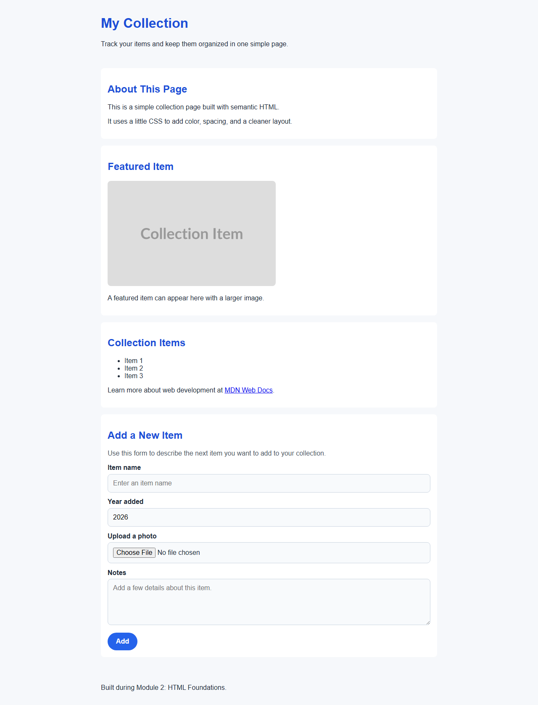
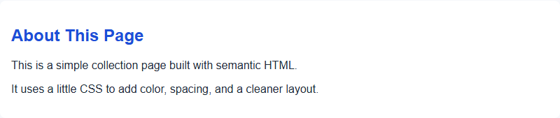
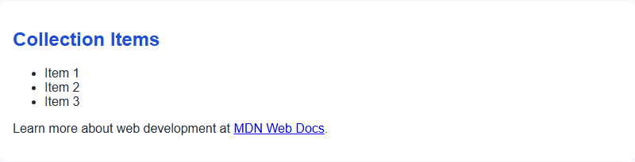

# Module 2: HTML Foundations

[← Previous Module](01-setup-and-orientation.md) | [Back to README](../README.md)

In this module, you'll build the first version of our **collection app** page using plain HTML.

HTML is the language that gives a web page its **structure**. It tells the browser what each piece of content is: a heading, a paragraph, a list, an image, or a link. The browser reads your HTML file from top to bottom, understands the tags you wrote, and turns that structure into the page you see on screen.

Today, our page will be **static**. That means it'll show content, but it won't respond to clicks or save data yet. Later in the workshop, Blazor will take this same page structure and make it interactive.

## 1. Understand what HTML does

**Expected outcome:** You can explain what HTML is and what the browser does with it.

HTML stands for **HyperText Markup Language**.

- **HyperText** means content can link to other content.
- **Markup** means we add tags around content to describe what it is.
- **Language** means it follows rules and syntax the browser understands.

When you open an `.html` file in a browser:

1. The browser reads the file.
2. It looks at each HTML tag.
3. It builds a document structure in memory.
4. It displays that structure as a web page.

For example, this HTML:

```html
<h1>My Collection</h1>
<p>This page shows items in my collection.</p>
```

tells the browser:

- `<h1>` is the main page heading.
- `<p>` is a paragraph of text.

The browser then shows a large heading and a normal paragraph.

### What you should see

You should understand that:

- HTML describes **meaning and structure**
- The browser turns that structure into a visible page
- The page we build now is the starting point for the Blazor app we'll create later

## 2. Start with a complete HTML document

**Expected outcome:** You can create a valid HTML file with the basic structure every page needs.

Every HTML page starts with a few important parts:

```html
<!DOCTYPE html>
<html lang="en">
<head>
    <meta charset="utf-8">
    <meta name="viewport" content="width=device-width, initial-scale=1.0">
    <title>My Collection</title>
</head>
<body>
</body>
</html>
```

Let's explain every line:

- `<!DOCTYPE html>` tells the browser to use modern HTML rules.
- `<html>` is the root element. Everything on the page lives inside it.
- `lang="en"` says the page language is English. This helps accessibility tools and search engines.
- `<head>` contains information **about** the page, not the visible page content.
- `<meta charset="utf-8">` tells the browser how to read text correctly.
- `<meta name="viewport" content="width=device-width, initial-scale=1.0">` helps the page scale correctly on phones and other small screens.
- `<title>` sets the text shown in the browser tab.
- `<body>` contains the content the user actually sees on the page.

### What you should see

When this file opens in a browser:

- The browser tab should say **My Collection**
- The page itself will look blank because the `<body>` is still empty

## 3. Add visible page content

**Expected outcome:** You can use headings and paragraphs to give your page a clear purpose.

Now let's add content inside the `<body>`:

```html
<!DOCTYPE html>
<html lang="en">
<head>
    <meta charset="utf-8">
    <meta name="viewport" content="width=device-width, initial-scale=1.0">
    <title>My Collection</title>
</head>
<body>
    <h1>My Collection</h1>
    <p>Welcome to my collection app.</p>
    <p>I'll use this page to keep track of items and upload photos.</p>
</body>
</html>
```

New tags in this step:

- `<h1>` is the most important heading on the page. A page should usually have one main `<h1>`.
- `<p>` creates a paragraph.

This content is simple, but it already tells the browser what matters most on the page.

### What you should see

You should see:

- A large heading that says **My Collection**
- Two paragraphs under the heading
- A page that clearly introduces the workshop app

## 4. Organize information with lists, links, and images

**Expected outcome:** You can add common elements people use on everyday web pages.

Our collection app needs to show useful information. Let's add a short list of features, a helpful link, and a sample image.

```html
<!DOCTYPE html>
<html lang="en">
<head>
    <meta charset="utf-8">
    <meta name="viewport" content="width=device-width, initial-scale=1.0">
    <title>My Collection</title>
</head>
<body>
    <h1>My Collection</h1>
    <p>Welcome to my collection app.</p>
    <p>I'll use this page to keep track of items and upload photos.</p>

    <h2>What this app will do</h2>
    <ul>
        <li>Add items to a collection</li>
        <li>Upload a photo for each item</li>
        <li>Review collection details in one place</li>
    </ul>

    <p>
        Learn more at
        <a href="https://developer.mozilla.org/">MDN Web Docs</a>.
    </p>

    
</body>
</html>
```

New tags and attributes:

- `<h2>` is a second-level heading. It introduces a new section under the main page heading.
- `<ul>` means **unordered list**. It creates a bulleted list.
- `<li>` means **list item**. Each bullet goes inside its own `<li>`.
- `<a>` creates a link.
- `href="..."` tells the link where to go.
- `` displays an image.
- `src="..."` tells the browser where the image file lives.
- `alt="..."` provides text describing the image. This helps screen readers and appears if the image cannot load.

Notice that the `` tag does not wrap other content. It stands on its own and points to an image source.

### What you should see

You should see:

- A new section heading: **What this app will do**
- A bulleted list of features
- A clickable link
- A sample image placeholder

## 5. Build a semantic layout for the collection page

**Expected outcome:** You can create a page layout with HTML elements that describe the purpose of each section.

As pages grow, structure matters more. Instead of putting everything directly in `<body>`, we can use **semantic HTML**. Semantic elements describe what each part of the page means.

Here's a stronger layout for our collection app:

```html
<!DOCTYPE html>
<html lang="en">
<head>
    <meta charset="utf-8">
    <meta name="viewport" content="width=device-width, initial-scale=1.0">
    <title>My Collection</title>
</head>
<body>
    <header>
        <h1>My Collection</h1>
        <p>Track your items and keep them organized in one simple page.</p>
    </header>

    <main>
        <section>
            <h2>About This Page</h2>
            <p>This is a simple collection page built with semantic HTML.</p>
            <p>It uses a little CSS to add color, spacing, and a cleaner layout.</p>
        </section>

        <section>
            <h2>Featured Item</h2>
            
            <p>A featured item can appear here with a larger image.</p>
        </section>

        <section>
            <h2>Collection Items</h2>
            <ul>
                <li>Item 1</li>
                <li>Item 2</li>
                <li>Item 3</li>
            </ul>

            <p>
                Learn more about web development at
                <a href="https://developer.mozilla.org/">MDN Web Docs</a>.
            </p>
        </section>
    </main>

    <footer>
        <p>Built during Module 2: HTML Foundations.</p>
    </footer>
</body>
</html>
```

Let's explain the new semantic elements:

- `<header>` holds introductory content for the page.
- `<main>` contains the main content of the page. A page should have one main area.
- `<section>` groups related content together.
- `<footer>` contains closing information about the page.

Why this matters:

- The page becomes easier for people to read.
- The structure is easier to style later with CSS.
- The structure is easier to turn into Blazor components later.

For example, one `<section>` today could become a reusable **collection item component** in Blazor.

### What you should see

You should see a page with clear sections:

- A top heading and introduction
- An "About This Page" section
- A featured item area with an image
- A list of collection items
- A footer at the bottom

## Full page example

Here's the complete version of the collection page that matches this module's checkpoint. This is what your page should look like when you're done:

```html
<!DOCTYPE html>
<html lang="en">
<head>
    <meta charset="utf-8">
    <meta name="viewport" content="width=device-width, initial-scale=1.0">
    <title>My Collection</title>
    <style>
        body {
            font-family: Arial, sans-serif;
            margin: 0;
            background-color: #f6f8fb;
            color: #1f2937;
        }

        header,
        main,
        footer {
            max-width: 800px;
            margin: 0 auto;
            padding: 1rem;
        }

        h1,
        h2 {
            color: #1d4ed8;
        }

        section {
            background-color: white;
            padding: 1rem;
            margin-bottom: 1rem;
            border-radius: 0.5rem;
        }

        img {
            max-width: 100%;
            height: auto;
            border-radius: 0.5rem;
        }

        .form-section p {
            margin-top: 0;
            color: #4b5563;
        }

        .item-form {
            display: grid;
            gap: 0.85rem;
        }

        .item-form label {
            display: block;
            font-weight: 600;
            margin-bottom: 0.35rem;
        }

        .item-form input,
        .item-form textarea {
            width: 100%;
            box-sizing: border-box;
            padding: 0.75rem;
            border: 1px solid #cbd5e1;
            border-radius: 0.5rem;
            font: inherit;
            background-color: #f8fafc;
        }

        .item-form textarea {
            min-height: 110px;
            resize: vertical;
        }

        .item-form button {
            justify-self: start;
            padding: 0.75rem 1.25rem;
            border: none;
            border-radius: 999px;
            background-color: #2563eb;
            color: white;
            font: inherit;
            font-weight: 700;
            cursor: pointer;
        }

        .item-form button:hover {
            background-color: #1d4ed8;
        }
    </style>
</head>
<body>
    <header>
        <h1>My Collection</h1>
        <p>Track your items and keep them organized in one simple page.</p>
    </header>

    <main>
        <section>
            <h2>About This Page</h2>
            <p>This is a simple collection page built with semantic HTML.</p>
            <p>It uses a little CSS to add color, spacing, and a cleaner layout.</p>
        </section>

        <section>
            <h2>Featured Item</h2>
            
            <p>A featured item can appear here with a larger image.</p>
        </section>

        <section>
            <h2>Collection Items</h2>
            <ul>
                <li>Item 1</li>
                <li>Item 2</li>
                <li>Item 3</li>
            </ul>

            <p>
                Learn more about web development at
                <a href="https://developer.mozilla.org/">MDN Web Docs</a>.
            </p>
        </section>

        <section class="form-section" id="add-item-form">
            <h2>Add a New Item</h2>
            <p>Use this form to describe the next item you want to add to your collection.</p>

            <form class="item-form">
                <div>
                    <label for="item-name">Item name</label>
                    <input
                        type="text"
                        id="item-name"
                        name="item-name"
                        placeholder="Enter an item name">
                </div>

                <div>
                    <label for="item-year">Year added</label>
                    <input
                        type="number"
                        id="item-year"
                        name="item-year"
                        min="1900"
                        max="2100"
                        value="2026">
                </div>

                <div>
                    <label for="item-photo">Upload a photo</label>
                    <input
                        type="file"
                        id="item-photo"
                        name="item-photo">
                </div>

                <div>
                    <label for="item-notes">Notes</label>
                    <textarea
                        id="item-notes"
                        name="item-notes"
                        placeholder="Add a few details about this item."></textarea>
                </div>

                <button type="submit">Add</button>
            </form>
        </section>
    </main>

    <footer>
        <p>Built during Module 2: HTML Foundations.</p>
    </footer>
</body>
</html>
```



*The rendered collection page: a clean, organized layout with the header, featured item area, collection items, and footer sections working together.*

## 6. A first look at CSS

**Expected outcome:** You can explain the difference between HTML structure and CSS styling.

HTML gives your page structure and meaning. CSS stands for **Cascading Style Sheets**, and it controls how that structure looks on the screen. In simple terms, HTML says "this is a heading" or "this is a list," while CSS says "make the heading blue" or "add space around this section."

You don't need to learn all of CSS today. For now, think of it as the presentation layer for your page. A small amount of CSS can make the same HTML easier to read and feel more polished without changing the page's content.

```html
<head>
    <meta charset="utf-8">
    <meta name="viewport" content="width=device-width, initial-scale=1.0">
    <title>My Collection</title>
    <style>
        body {
            font-family: Arial, sans-serif;
            background-color: #f6f8fb;
            color: #1f2937;
        }

        h1,
        h2 {
            color: #1d4ed8;
        }

        section {
            background-color: white;
            padding: 1rem;
            margin-bottom: 1rem;
            border-radius: 0.5rem;
        }
    </style>
</head>
```

In this example, the HTML page structure stays the same, but the CSS changes the presentation. The headings get color, the page gets a soft background, and each section gets spacing to make the layout easier to scan.

### What CSS rules are

A **CSS rule** has two main parts:

1. **Selector** — which HTML element(s) the rule applies to (like `body`, `h1`, `section`, or `.classname`)
2. **Declaration block** — one or more property-value pairs inside curly braces, each with a colon and ending with a semicolon

Here's the structure:

```css
selector {
    property: value;
    property: value;
}
```

For example:

```css
h1 {
    color: blue;
    font-size: 32px;
}
```

This rule says: "Find every `<h1>` on the page, make the text blue, and set the font size to 32 pixels."

### Sample CSS styles

Here are some of the most practical CSS properties you'll use:

```css
/* Change text color */
p {
    color: #333333;
}

/* Change background color */
section {
    background-color: white;
}

/* Adjust font and text */
body {
    font-family: Arial, sans-serif;
    font-size: 16px;
}

/* Add space inside an element (padding) */
section {
    padding: 1rem;
}

/* Add space outside an element (margin) */
h1 {
    margin-bottom: 1.5rem;
}

/* Add a border around an element */
article {
    border: 1px solid #cccccc;
}

/* Round the corners of an element */
section {
    border-radius: 0.5rem;
}
```



*The styled featured item section: CSS transforms the plain HTML structure into a polished card with colors, spacing, and rounded corners.*

### Where CSS rules can appear

CSS rules can live in four different places. Each approach has a purpose.

#### 1. Inline styles on an HTML element

You can add CSS directly to any tag using the `style` attribute:

```html
<p style="color: red; font-size: 18px;">This text is red and larger.</p>
<section style="background-color: yellow;">This section has a yellow background.</section>
```

**When to use:** Quick one-off styling for a single element. This approach is fast but hard to maintain if you need to change many elements.

#### 2. In a `<style>` block in the HTML `<head>`

You can put all your CSS rules inside a `<style>` tag in the page's `<head>` section:

```html
<!DOCTYPE html>
<html lang="en">
<head>
    <title>My Collection</title>
    <style>
        body {
            background-color: #f6f8fb;
            font-family: Arial, sans-serif;
        }

        h1 {
            color: #1d4ed8;
        }

        section {
            background-color: white;
            padding: 1rem;
            margin-bottom: 1rem;
        }
    </style>
</head>
<body>
    <h1>My Collection</h1>
    <section>Content here</section>
</body>
</html>
```

**When to use:** For single-page sites or when all your styling is in one place. This keeps HTML and CSS together in one file but can get large for big pages.

#### 3. In a linked external CSS file

You can put all your CSS in a separate `.css` file and link to it from your HTML:

Create a file named `styles.css`:

```css
/* styles.css */
body {
    background-color: #f6f8fb;
    font-family: Arial, sans-serif;
}

h1 {
    color: #1d4ed8;
}

section {
    background-color: white;
    padding: 1rem;
    margin-bottom: 1rem;
}
```

Then link to it in your HTML `<head>`:

```html
<!DOCTYPE html>
<html lang="en">
<head>
    <title>My Collection</title>
    <link rel="stylesheet" href="styles.css">
</head>
<body>
    <h1>My Collection</h1>
    <section>Content here</section>
</body>
</html>
```

**When to use:** For websites with multiple pages or when your CSS is large. This keeps HTML and CSS separate and lets you reuse the same styles across many pages.

#### 4. CSS classes for reusable patterns

Instead of styling individual elements, you can define a **class** in CSS and apply it to multiple HTML elements:

```html
<!DOCTYPE html>
<html lang="en">
<head>
    <title>My Collection</title>
    <style>
        .card {
            background-color: white;
            padding: 1rem;
            margin-bottom: 1rem;
            border-radius: 0.5rem;
        }

        .highlight {
            color: #1d4ed8;
            font-weight: bold;
        }
    </style>
</head>
<body>
    <article class="card">
        <h2 class="highlight">Vintage Camera</h2>
        <p>A classic film camera from the collection.</p>
    </article>

    <article class="card">
        <h2 class="highlight">Comic Book Issue #1</h2>
        <p>A favorite item with a cover photo.</p>
    </article>
</body>
</html>
```

Notice the CSS class names start with a dot (`.card`, `.highlight`), but when you use them in HTML, you omit the dot and put the name in a `class` attribute.

**When to use:** When you want to apply the same style to multiple elements. This is the most flexible and maintainable approach for large projects. In Blazor later, you'll use classes constantly to style components.

### Learn more about CSS

- [MDN CSS basics](https://developer.mozilla.org/en-US/docs/Learn/Getting_started_with_the_web/CSS_basics)
- [W3Schools CSS](https://www.w3schools.com/css/)
- [CSS-Tricks Beginner Guides](https://css-tricks.com/guides/beginner/)

## 7. Work with forms and input elements

**Expected outcome:** You understand how HTML forms collect input and how buttons, labels, and inputs work together.

A `<form>` groups input elements so the browser knows they belong together. Forms are commonly used when a page needs to collect information and submit it somewhere.

Inside a form, you can use different kinds of inputs depending on the data you want:

- `<input type="text">` for short text like a title or name
- `<input type="number">` for numeric values like a quantity or year
- `<input type="file">` for selecting a file from the computer, which we'll use later for item photos

Buttons are also important in forms. A `<button>` is different from an `<a>` link:

- A link takes the user to another page or location
- A button triggers an action, such as submitting a form

Use a `<label>` with each input when possible. Labels make forms easier to understand, improve accessibility, and let users click the label text to focus the related field.

You can also add a `placeholder` attribute to show a short hint inside an input before the user types.

For longer, multi-line text, use a `<textarea>` instead of a single-line `<input>`.

### Example: add a new item to your collection

```html
<form>
    <label for="item-name">Item name</label>
    <input type="text" id="item-name" name="item-name" placeholder="Enter an item name">

    <button type="submit">Add</button>
</form>
```

In this example:

- The `<form>` groups the field and the button
- The `<label>` describes the text box
- The `for` attribute on the label matches the `id` on the input
- The `placeholder` gives the user a hint
- The `<button>` gives the user a way to submit the form

You can also imagine adding other fields later:

```html
<input type="number" id="item-year" name="item-year">
<input type="file" id="item-photo" name="item-photo">
<textarea id="item-notes" name="item-notes"></textarea>
```

In Module 3, Blazor will make these elements interactive using data binding and event handlers. The HTML structure stays the same — Blazor just connects C# code to these elements.

### What you should see

You should see a simple form with:

- A label that says `Item name`
- A text box with placeholder text
- A button labeled `Add`



*The form section in the checkpoint page, showing the labeled fields learners add in Module 2 before the app becomes interactive.*

## 8. Connect the HTML file to the browser and the future Blazor app

**Expected outcome:** You understand how the code in the file maps to what appears in the browser.

Here's the big idea:

- The HTML file is plain text you write in an editor.
- The browser reads that text and renders it as a page.
- Each tag becomes part of what you see on screen.

Examples:

- Change the text inside `<h1>` and the main page heading changes.
- Add another `<li>` and the browser shows another list item.
- Change the `src` of an `` and the browser loads a different image.
- Add another `<article>` and the page shows another collection item.

This is also how our workshop app will grow:

- **Today:** static HTML shows the page structure
- **Next:** Blazor components will generate HTML for us
- **Later:** C# code and event handlers will react to button clicks, form input, and uploaded photos

That means the HTML you learned here is not being thrown away. It becomes the foundation for everything the browser will show when the app becomes interactive.

### What you should see

You should understand that:

- HTML files directly control page structure
- Browsers display the result of that structure
- Blazor still produces HTML in the browser, but it helps us build it with reusable components and interactive behavior

---
## Next Module

Your HTML page looks great, but it's static. In [Module 3: Blazor Fundamentals](03-blazor-fundamentals.md), we'll make it interactive!
