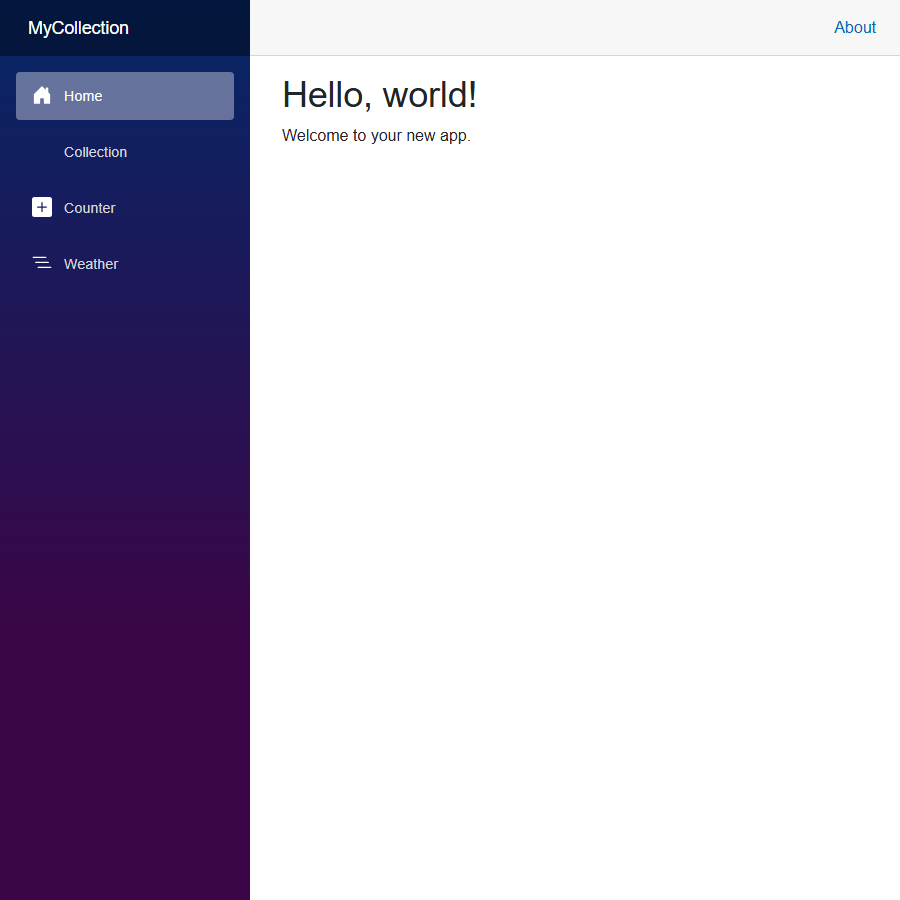
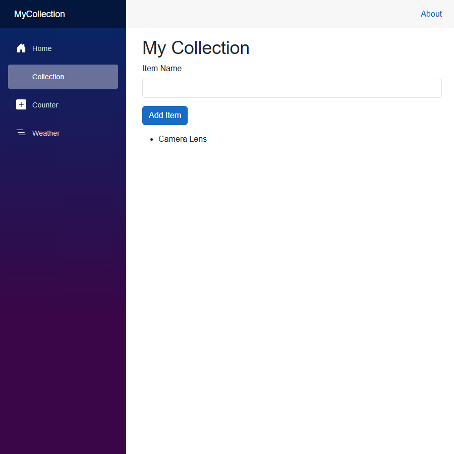

# Module 3: Blazor Fundamentals

[← Previous Module](02-html-foundations.md) | [Back to README](../README.md)

This is the module where your Blazor app begins. You will create a new project named `MyCollection`, run it, and then make the home page interactive.

By the end of this module, you will be able to:

1. Create a Blazor app with `dotnet new`
2. Recognize the main folders and files in the new project
3. Understand Blazor render modes at a beginner level
4. Read and edit a `.razor` component
5. Show data on the page with C#
6. Handle a button click to add items to a list
7. Use `dotnet watch` and hot reload while you work

## Step 1: Create the app

Open a terminal in the folder where you want to keep your code and run `dotnet new blazor -n MyCollection`.

That command does a few things for you:

- Creates a new folder named `MyCollection`
- Creates a Blazor Web App project inside it
- Adds starter files so you can run the app right away

Next, move into the project folder with `cd MyCollection`.

## Step 2: Look at what was created

When the template finishes, you will see a project with several important files and folders:

- `MyCollection.csproj` - the project file that tells .NET how to build the app
- `Program.cs` - the startup code that configures and runs the app
- `Components\App.razor` - the root component for the UI
- `Components\Pages` - page components such as the home page
- `Components\Layout` - shared layout pieces like navigation
- `wwwroot` - static files such as CSS and images

You do not need to memorize everything yet. The important idea is that a Blazor app is made from components, and those components live in `.razor` files.

## Step 3: Run the app

From inside `MyCollection`, start the app with `dotnet watch`.

`dotnet watch` builds the app, runs it locally, and keeps watching for file changes. When you save a file, Blazor can often update the browser without a full restart.

When the app starts, open the local URL shown in the terminal. You should see the starter Blazor site running in your browser.


*The default Blazor app home page after creation, showing the starter template in the browser.*

## Step 4: Understand Blazor render modes

Blazor can render your UI in different ways. For this workshop, you only need a clear beginner-friendly picture of the three main options.

### Static SSR

**Static SSR** stands for **static server-side rendering**.

- The page is rendered on the server
- The browser receives plain HTML
- The page loads quickly
- There is no live interactivity after the HTML is sent

Use this when a page mostly shows content and does not need buttons, forms, or other live UI behavior.

### Interactive Server

**Interactive Server** keeps the UI logic on the server and sends updates over a SignalR connection. In code, you will usually see this render mode written as `InteractiveServer`.

- The page is first rendered on the server
- Interactivity happens through a real-time connection
- Your C# runs on the server
- The browser updates when events happen

Use this when you want interactive UI without downloading .NET runtime code into the browser. This is the mode we will use in the workshop.

### Interactive WebAssembly

**Interactive WebAssembly** runs .NET in the browser.

- The browser downloads the app and .NET runtime files
- Your C# runs in the browser after it loads
- It can reduce server work for interactive UI
- The first load is usually larger than server-based interactivity

Use this when you want more client-side execution in the browser.

### Which one are we using?

For this workshop, use **Interactive Server** because it gives us live interactivity while keeping the setup simple.

## Step 5: Meet your first component

A **component** is a reusable piece of UI. In Blazor, components are usually written in `.razor` files.

A `.razor` file can contain:

- HTML markup
- Razor syntax such as `@page` and `@bind`
- C# code inside an `@code` block

Open `Components\Pages\Home.razor` and replace the main page content with something like this:

```razor
@page "/"
@rendermode InteractiveServer

<PageTitle>My Collection</PageTitle>

<h1>My Collection</h1>
<p>Welcome to your collection app.</p>
```

### What each part means

- `@page "/"` makes this component respond to the home page route
- `@rendermode InteractiveServer` tells Blazor to use interactive server rendering for this component
- `<PageTitle>` sets the text shown in the browser tab
- `<h1>` is the visible page heading

## Step 6: Show data on the page

Now add an `@code` block so the component can hold data.

```razor
@page "/"
@rendermode InteractiveServer

<PageTitle>My Collection</PageTitle>

<h1>My Collection</h1>
<p>Status: @statusMessage</p>

@code {
    private string statusMessage = "Ready to add your first item.";
}
```

`statusMessage` is a C# field on the component, and `@statusMessage` renders it into the page.

This is one of the core ideas in Blazor: your component stores data in C#, and Razor markup displays that data.

## Step 7: Add data binding

**Data binding** keeps a UI element and a C# value in sync.

```razor
@page "/"
@rendermode InteractiveServer

<PageTitle>My Collection</PageTitle>

<h1>My Collection</h1>

<input @bind="newItemName" placeholder="Enter an item name" />
<p>Preview: @newItemName</p>

@code {
    private string newItemName = "First item";
}
```

As the user types in the text box, `newItemName` changes automatically.

## Step 8: Handle a button click and add items

Now connect the UI to a method.

```razor
@page "/"
@rendermode InteractiveServer

<PageTitle>My Collection</PageTitle>

<h1>My Collection</h1>

<input @bind="newItemName" placeholder="Enter an item name" />
<button @onclick="AddItem">Add item</button>

<p>@statusMessage</p>

<ul>
    @foreach (var item in items)
    {
        <li>@item</li>
    }
</ul>

@code {
    private string newItemName = "";
    private string statusMessage = "Ready to add your first item.";
    private List<string> items = new();

    private void AddItem()
    {
        if (string.IsNullOrWhiteSpace(newItemName))
        {
            return;
        }

        items.Add(newItemName);
        statusMessage = $"Added: {newItemName}";
        newItemName = "";
    }
}
```

### What is happening here?

- `@bind` keeps the text box and `newItemName` in sync
- `@onclick` calls `AddItem` when the button is clicked
- `items` stores the collection items
- `@foreach` renders one `<li>` for each item in the list
- After the method changes the data, Blazor re-renders the component


*The Collection page with the input field, "Add item" button, and a list of items added interactively.*

## Step 9: Work with `dotnet watch` and hot reload

Keep `dotnet watch` running while you edit the app.

A simple workflow is:

1. Start the app with `dotnet watch`
2. Open the site in your browser
3. Change text in the component
4. Save the file
5. Watch the browser update

A quick hot reload test is changing this line:

```razor
<h1>My Collection</h1>
```

Save the file and look for the updated page in the browser.

## Key ideas to remember

- `dotnet new blazor -n MyCollection` creates the app for this workshop
- A Blazor app is built from components in `.razor` files
- `@page` gives a component a route
- Render modes control where and how the UI runs
- We are using **Interactive Server** in this workshop
- `@bind` handles simple data binding
- `@onclick` connects a UI event to a C# method
- `dotnet watch` helps you develop faster with hot reload

---
## Next Module

Now that you can build interactive components, let's learn the C# behind them. Head to [Module 4: C# Basics in Context](04-csharp-basics.md) to understand the code that powers your Blazor app.
