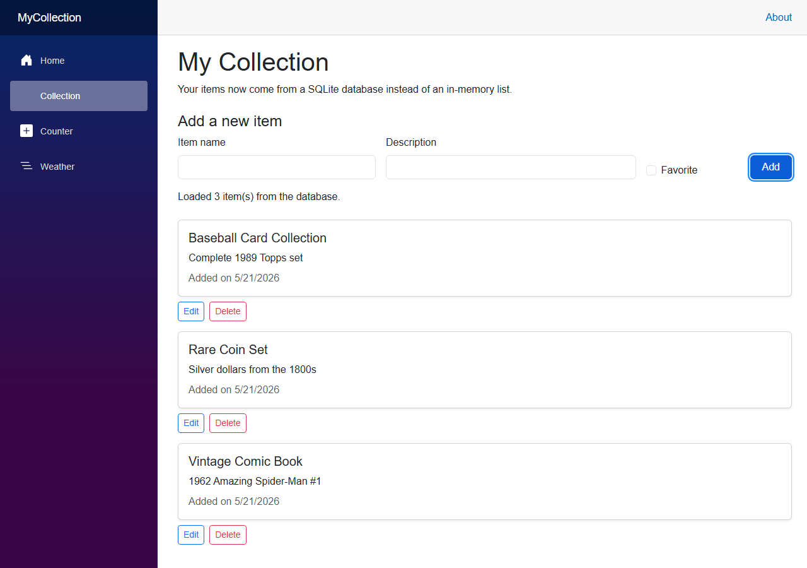

# Module 6: Data with Entity Framework Core & SQLite

[← Previous Module](05-git-and-github.md) | [Back to README](../README.md)

In this module, we're going to replace your in-memory collection list with a real database. We'll keep using the `MyCollection` Blazor app from Modules 3 and 4, keep using the `CollectionItem` model from `MyCollection.Models`, and add Entity Framework Core with SQLite so your data survives an app restart.

---

## 1. Why We Need a Database

Right now, your `MyCollection` page stores items in a normal C# list. That works for learning, but it has one big problem: **the list only lives in memory while the app is running**.

That means:

- You add items
- The page looks correct
- You stop the app
- You start the app again
- Everything is gone!

A **database** solves that problem. A database stores data on disk so your app can read it later.

For this workshop, we'll use **SQLite** because it's beginner-friendly:

- It stores data in a single file
- It does not require a separate database server install
- It works well for small projects and learning
- It fits nicely with local development in VS Code

By the end of this module, your `MyCollection` app will save collection items to a `MyCollection.db` file instead of losing them on every restart. That's a HUGE improvement.

---

## 2. What Is Dependency Injection (DI)?

This module is your first real introduction to **dependency injection**, often shortened to **DI**.

Here's a beginner-friendly way to think about it:

> Instead of every part of your app building its own tools, it asks for the tools it needs, and the application hands those tools to it.

### A simple analogy

Imagine you are working at a table and need a marker.

- **Without DI:** you leave the table, go find a marker, decide which one to use, and bring it back yourself
- **With DI:** you say, "I need a marker," and someone hands you the marker that has already been chosen and prepared

That is the basic idea of DI. It sounds fancier than it is.

In ASP.NET Core and Blazor:

1. You **register** services in `Program.cs`
2. The framework keeps track of how to create them
3. A page or class can **request** a service when it needs it
4. The framework **injects** that service for you

### What counts as a service?

A service is just an object your app wants to reuse, such as:

- A database context
- A logging service
- A helper class
- A custom data service you create later

In this module, the service will be your `CollectionContext`.

### The DI pattern you will use

Register the service in `Program.cs`:

```csharp
builder.Services.AddDbContext<CollectionContext>(options =>
    options.UseSqlite("Data Source=MyCollection.db"));
```

Then request it where you need it.

In a Razor component, you can use `@inject`:

```razor
@inject CollectionContext Context
```

In a regular C# class, you will often request services through a constructor:

```csharp
public class ItemService
{
    private readonly CollectionContext context;

    public ItemService(CollectionContext context)
    {
        this.context = context;
    }
}
```

### Why DI is useful

DI may feel like extra ceremony at first, but it solves real problems:

- **Single source of configuration:** you decide in one place how a service should be created
- **Flexibility:** if you change how something is built later, the rest of the app usually does not need to change much
- **Testability:** it is easier to replace a real service with a fake one in tests
- **Cleaner code:** your components focus on using a service instead of constructing it

That matters now because you do **not** want every page to create its own database connection setup. Instead, you will configure the database once in `Program.cs` and then inject `CollectionContext` into the page that needs it.

Keep this mental model in mind for later modules. DI is a major building block in modern ASP.NET applications.

---

## 3. Adding NuGet Packages

In Module 4, you used `dotnet add reference` to connect one project you own to another project you own.

```bash
dotnet add reference ..\MyCollection.Models
```

That was a **project reference**.

In this module, you will use **NuGet packages**. **NuGet** is .NET's package manager. It lets you add published libraries from the internet to your project.

Open a terminal in the `MyCollection` project folder and run:

```bash
cd MyCollection
dotnet add package Microsoft.EntityFrameworkCore.Sqlite
dotnet add package Microsoft.EntityFrameworkCore.Design
```

What these packages do:

- `Microsoft.EntityFrameworkCore.Sqlite` gives EF Core a SQLite provider
- `Microsoft.EntityFrameworkCore.Design` adds design-time support for tools such as migrations

So the contrast is:

- `dotnet add reference` -> use code from another local project
- `dotnet add package` -> use code from a published NuGet package

Both commands add something your project can use, but they come from different places.

---

## 4. Creating a DbContext

Before creating the database context, update `CollectionItem` so EF Core has a primary key. By convention, a property named `Id` becomes the key column for the table.

Update `MyCollection.Models\CollectionItem.cs`:

```csharp
namespace MyCollection.Models;

public class CollectionItem
{
    public int Id { get; set; }
    public string Name { get; set; } = string.Empty;
    public string Description { get; set; } = string.Empty;
    public DateTime DateAdded { get; set; } = DateTime.Today;
    public bool IsFavorite { get; set; }
}
```

Now create a `Data` folder inside the main `MyCollection` app project and add `CollectionContext.cs` there.

`MyCollection\Data\CollectionContext.cs`

```csharp
using Microsoft.EntityFrameworkCore;
using MyCollection.Models;

namespace MyCollection.Data;

public class CollectionContext : DbContext
{
    public CollectionContext(DbContextOptions<CollectionContext> options)
        : base(options)
    {
    }

    public DbSet<CollectionItem> CollectionItems => Set<CollectionItem>();
}
```

### What `DbContext` does

Think of `DbContext` as your app's **session with the database**.

It is responsible for:

- Knowing which models should become tables
- Querying data from the database
- Tracking changes to objects
- Saving those changes back to the database

The `DbSet<CollectionItem>` property represents the table of collection items.

One important decision for this workshop: `CollectionContext` belongs in the main `MyCollection` app project, **not** in `MyCollection.Models`. The models project should stay focused on simple shared types. The app project is where you configure and use the database.

---

## 5. Registering the DbContext with DI

Now connect the DI idea from Section 2 to the database context you just created.

You will register `CollectionContext` in `Program.cs` so Blazor can inject it later.

Update `MyCollection\Program.cs` to this:

```csharp
using Microsoft.EntityFrameworkCore;
using MyCollection.Components;
using MyCollection.Data;

var builder = WebApplication.CreateBuilder(args);

// Add services to the container.
builder.Services.AddRazorComponents()
    .AddInteractiveServerComponents();

builder.Services.AddDbContext<CollectionContext>(options =>
    options.UseSqlite("Data Source=MyCollection.db"));

var app = builder.Build();

// Configure the HTTP request pipeline.
if (!app.Environment.IsDevelopment())
{
    app.UseExceptionHandler("/Error", createScopeForErrors: true);
    app.UseHsts();
}

app.UseStatusCodePagesWithReExecute("/not-found", createScopeForStatusCodePages: true);
app.UseHttpsRedirection();
app.UseAntiforgery();

app.MapStaticAssets();
app.MapRazorComponents<App>()
    .AddInteractiveServerRenderMode();

app.Run();
```

Notice where the registration goes:

- **After** `var builder = WebApplication.CreateBuilder(args);`
- **Before** `var app = builder.Build();`

That placement matters because you are telling the application which services exist **before** the app is built.

This is the full DI flow:

1. `Program.cs` registers `CollectionContext`
2. The framework knows how to create it
3. Your Razor page asks for it with `@inject`
4. Blazor gives the page a ready-to-use `CollectionContext`

This is the approach you should use in this workshop. Do **not** put SQLite configuration in an `OnConfiguring` override for this module.

---

## 6. Migrations

EF Core uses **migrations** to keep your database schema in sync with your code.

A migration is a version-controlled description of a database change. For example:

- Create the `CollectionItems` table
- Add a new column later
- Rename or remove columns in future modules

If you do not already have the EF CLI tool installed, run:

```bash
dotnet tool install --global dotnet-ef
```

If it is already installed, the command may tell you that nothing changed. That is fine.

From the `MyCollection` folder, create your first migration:

```bash
dotnet ef migrations add InitialCreate
```

Then apply it to the SQLite database:

```bash
dotnet ef database update
```

After those commands run, EF Core will:

- Create a `Migrations` folder in `MyCollection`
- Generate migration source files
- Create the `MyCollection.db` SQLite file
- Build the `CollectionItems` table for you

You will usually see files similar to these:

```text
Migrations\20260518112200_InitialCreate.cs
Migrations\20260518112200_InitialCreate.Designer.cs
Migrations\CollectionContextModelSnapshot.cs
```

The long number at the start is a timestamp, so your filename will be different.

**Important:** migration files are source code. Commit them to Git. They help you and your teammates recreate the same database structure later.

---

## 7. Updating the Blazor Page - Read (the R in CRUD)

**CRUD** stands for:

- **Create**
- **Read**
- **Update**
- **Delete**

The first thing to replace is the hardcoded list from Module 4. Instead of creating starter data in memory, you will load rows from the database.

Here is a complete `Collection.razor` page that uses EF Core for all four CRUD operations.

`MyCollection\Components\Pages\Collection.razor`

```razor
@page "/collection"
@rendermode InteractiveServer
@using Microsoft.EntityFrameworkCore
@using MyCollection.Data
@using MyCollection.Models
@inject CollectionContext Context

<PageTitle>My Collection</PageTitle>

<h1>My Collection</h1>
<p>Your items now come from a SQLite database instead of an in-memory list.</p>

<h2 class="h4 mt-4">Add a new item</h2>
<div class="row g-3 align-items-end">
    <div class="col-md-4">
        <label for="newItemName" class="form-label">Item name</label>
        <input id="newItemName" class="form-control" @bind="newItem.Name" />
    </div>
    <div class="col-md-5">
        <label for="newItemDescription" class="form-label">Description</label>
        <input id="newItemDescription" class="form-control" @bind="newItem.Description" />
    </div>
    <div class="col-md-2">
        <div class="form-check">
            <input id="newItemFavorite" type="checkbox" class="form-check-input" @bind="newItem.IsFavorite" />
            <label for="newItemFavorite" class="form-check-label">Favorite</label>
        </div>
    </div>
    <div class="col-md-1">
        <button class="btn btn-primary w-100" @onclick="AddItemAsync">Add</button>
    </div>
</div>

<p class="mt-3">@statusMessage</p>

@if (editItem is not null)
{
    <section class="card mt-4">
        <div class="card-body">
            <h2 class="h5">Edit item</h2>

            <div class="row g-3 align-items-end">
                <div class="col-md-4">
                    <label for="editItemName" class="form-label">Item name</label>
                    <input id="editItemName" class="form-control" @bind="editItem.Name" />
                </div>
                <div class="col-md-5">
                    <label for="editItemDescription" class="form-label">Description</label>
                    <input id="editItemDescription" class="form-control" @bind="editItem.Description" />
                </div>
                <div class="col-md-2">
                    <div class="form-check">
                        <input id="editItemFavorite" type="checkbox" class="form-check-input" @bind="editItem.IsFavorite" />
                        <label for="editItemFavorite" class="form-check-label">Favorite</label>
                    </div>
                </div>
                <div class="col-md-1 d-flex gap-2">
                    <button class="btn btn-success" @onclick="SaveEditAsync">Save</button>
                    <button class="btn btn-outline-secondary" @onclick="CancelEdit">Cancel</button>
                </div>
            </div>
        </div>
    </section>
}

@if (items.Count == 0)
{
    <p class="mt-4">No items in the database yet. Add your first one above.</p>
}
else
{
    <div class="mt-4">
        @foreach (var item in items)
        {
            <div class="mb-3">
                <CollectionItemCard Item="item" />

                <div class="d-flex gap-2 mt-2">
                    <button class="btn btn-outline-primary btn-sm" @onclick="() => StartEditAsync(item.Id)">
                        Edit
                    </button>
                    <button class="btn btn-outline-danger btn-sm" @onclick="() => DeleteItemAsync(item.Id)">
                        Delete
                    </button>
                </div>
            </div>
        }
    </div>
}

@code {
    private List<CollectionItem> items = new();
    private CollectionItem newItem = new() { DateAdded = DateTime.Today };
    private CollectionItem? editItem;
    private string statusMessage = "Loading items from the database...";

    protected override async Task OnInitializedAsync()
    {
        await LoadItemsAsync();
    }

    private async Task LoadItemsAsync()
    {
        items = await Context.CollectionItems
            .OrderByDescending(item => item.DateAdded)
            .ThenBy(item => item.Name)
            .ToListAsync();

        statusMessage = items.Count == 0
            ? "Your database is ready. Add your first item."
            : $"Loaded {items.Count} item(s) from the database.";
    }

    private async Task AddItemAsync()
    {
        if (string.IsNullOrWhiteSpace(newItem.Name))
        {
            statusMessage = "Enter a name before adding an item.";
            return;
        }

        newItem.DateAdded = DateTime.Today;
        Context.CollectionItems.Add(newItem);
        await Context.SaveChangesAsync();

        statusMessage = $"Added: {newItem.Name}";
        newItem = new CollectionItem { DateAdded = DateTime.Today };
        await LoadItemsAsync();
    }

    private async Task StartEditAsync(int id)
    {
        editItem = await Context.CollectionItems
            .AsNoTracking()
            .FirstOrDefaultAsync(item => item.Id == id);

        if (editItem is null)
        {
            statusMessage = "That item could not be found.";
        }
    }

    private void CancelEdit()
    {
        editItem = null;
        statusMessage = "Edit cancelled.";
    }

    private async Task SaveEditAsync()
    {
        if (editItem is null)
        {
            return;
        }

        if (string.IsNullOrWhiteSpace(editItem.Name))
        {
            statusMessage = "Enter a name before saving the item.";
            return;
        }

        var itemToUpdate = await Context.CollectionItems
            .FirstOrDefaultAsync(item => item.Id == editItem.Id);

        if (itemToUpdate is null)
        {
            statusMessage = "That item could not be found.";
            return;
        }

        itemToUpdate.Name = editItem.Name;
        itemToUpdate.Description = editItem.Description;
        itemToUpdate.IsFavorite = editItem.IsFavorite;

        await Context.SaveChangesAsync();

        statusMessage = $"Updated: {itemToUpdate.Name}";
        editItem = null;
        await LoadItemsAsync();
    }

    private async Task DeleteItemAsync(int id)
    {
        var itemToDelete = await Context.CollectionItems.FindAsync(id);

        if (itemToDelete is null)
        {
            statusMessage = "That item could not be found.";
            return;
        }

        Context.CollectionItems.Remove(itemToDelete);
        await Context.SaveChangesAsync();

        if (editItem?.Id == id)
        {
            editItem = null;
        }

        statusMessage = $"Deleted: {itemToDelete.Name}";
        await LoadItemsAsync();
    }
}
```

Focus on the **Read** parts first:

- `@inject CollectionContext Context` requests the service from DI
- `OnInitializedAsync()` runs when the page starts
- `LoadItemsAsync()` queries the database
- `ToListAsync()` returns the rows as a `List<CollectionItem>`

That is the moment when your app stops depending on a hardcoded list and starts reading from SQLite.

---

## 8. Create - Adding New Items

To create a new row, you build a `CollectionItem`, add it to the `DbSet`, and then call `SaveChangesAsync()`.

The key code is:

```csharp
private async Task AddItemAsync()
{
    if (string.IsNullOrWhiteSpace(newItem.Name))
    {
        statusMessage = "Enter a name before adding an item.";
        return;
    }

    newItem.DateAdded = DateTime.Today;
    Context.CollectionItems.Add(newItem);
    await Context.SaveChangesAsync();

    statusMessage = $"Added: {newItem.Name}";
    newItem = new CollectionItem { DateAdded = DateTime.Today };
    await LoadItemsAsync();
}
```

What happens here:

1. You validate the input
2. You set `DateAdded`
3. `Add()` tells EF Core to insert a new row
4. `SaveChangesAsync()` sends that change to SQLite
5. You reload the list so the UI shows the latest data

This is the **C** in CRUD.

---

## 9. Update - Editing Items

Updating usually happens in two steps:

1. Load the item you want to edit
2. Save the changed values

In the page above, clicking **Edit** calls this method:

```csharp
private async Task StartEditAsync(int id)
{
    editItem = await Context.CollectionItems
        .AsNoTracking()
        .FirstOrDefaultAsync(item => item.Id == id);

    if (editItem is null)
    {
        statusMessage = "That item could not be found.";
    }
}
```

That loads a single item by its `Id` so the edit form can display the current values.

When the user clicks **Save**, this method runs:

```csharp
private async Task SaveEditAsync()
{
    if (editItem is null)
    {
        return;
    }

    var itemToUpdate = await Context.CollectionItems
        .FirstOrDefaultAsync(item => item.Id == editItem.Id);

    if (itemToUpdate is null)
    {
        statusMessage = "That item could not be found.";
        return;
    }

    itemToUpdate.Name = editItem.Name;
    itemToUpdate.Description = editItem.Description;
    itemToUpdate.IsFavorite = editItem.IsFavorite;

    await Context.SaveChangesAsync();
    await LoadItemsAsync();
}
```

Why this works:

- EF Core loads the row from the database
- You change properties on that object
- `SaveChangesAsync()` sees the changed values
- EF Core writes an `UPDATE` to the database

This is the **U** in CRUD.

---

## 10. Delete - Removing Items

Deleting is straightforward: find the item, remove it from the `DbSet`, then save.

```csharp
private async Task DeleteItemAsync(int id)
{
    var itemToDelete = await Context.CollectionItems.FindAsync(id);

    if (itemToDelete is null)
    {
        statusMessage = "That item could not be found.";
        return;
    }

    Context.CollectionItems.Remove(itemToDelete);
    await Context.SaveChangesAsync();

    statusMessage = $"Deleted: {itemToDelete.Name}";
    await LoadItemsAsync();
}
```

Each item's delete button calls that method:

```razor
<button class="btn btn-outline-danger btn-sm" @onclick="() => DeleteItemAsync(item.Id)">
    Delete
</button>
```

This is the **D** in CRUD.

At this point, your page supports all four operations:

- **Create** new items
- **Read** items from SQLite
- **Update** existing items
- **Delete** items you no longer want

Run the app and navigate to `/collection`. Your page should look something like this — a form at the top, items listed below with edit and delete buttons:



---

## 11. Updating `.gitignore`

Module 5 taught you that not every file belongs in Git.

Your SQLite database file is **generated output**, not source code. Students on different machines will each create their own local database file. That means the `.db` file should be ignored.

Update your repository's `.gitignore` file and add:

```text
*.db
*.db-shm
*.db-wal
```

These extra files can appear when SQLite is actively using the database.

Important Git rule for this module:

- **Do commit:** C# files, Razor files, and the `Migrations` folder
- **Do not commit:** `MyCollection.db`, `*.db-shm`, or `*.db-wal`

That reinforces a good habit from Module 5: commit the files that describe how your app works, not generated machine-specific files.

---

## 12. Viewing Your Database

After `dotnet ef database update`, you will have a file named `MyCollection.db` in your `MyCollection` project folder.

You do **not** need a separate database tool to make the app work. Your Blazor page already reads and writes the data through EF Core.

If you want to look inside the database manually, an optional tool many people use is **DB Browser for SQLite**. It can show you:

- Tables
- Rows
- Column names
- Data values

That can be fun for curiosity, but it is optional. The important point is that your application can already create, read, update, and delete data on its own.

---
## Next Module

[Next Module →](07-pdf-reports.md)

In Module 7, you will build on this database-backed app by adding Aspire observability, orchestration, and dev tunnel support before you add photo uploads in Module 8.
