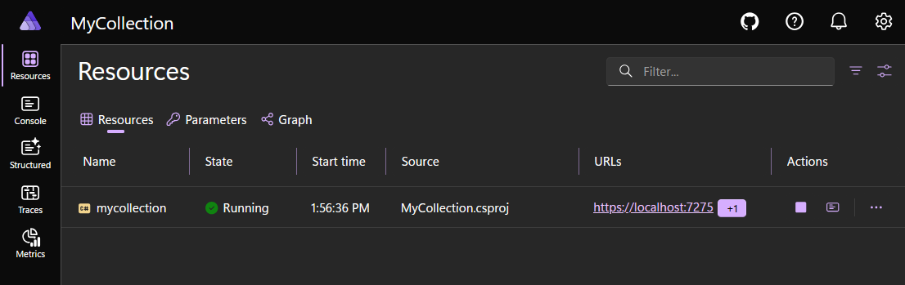
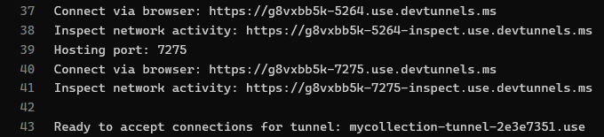
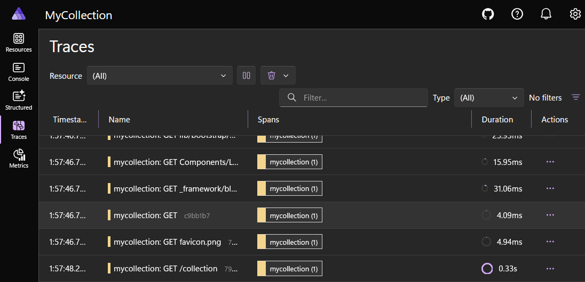

# Module 8: Observability with .NET Aspire

[← Previous Module](07-pdf-reports.md) | [Back to README](../README.md)

In this module, you'll add Aspire to the `MyCollection` solution. Aspire gives you a local orchestration layer and a dashboard for observability. That means you can start your app through a single entry point, inspect structured logs, watch request traces, and see runtime metrics without building your own monitoring setup first.

Even though `MyCollection` is still a single Blazor app, this is the right time to add Aspire. It makes local development easier today, and it gives you a clean path for future services later.

By the end of this module, you'll install the Aspire CLI, run `aspire init` in the solution root, review the generated `MyCollection.AppHost` and `MyCollection.ServiceDefaults` projects, wire your app into the AppHost, and run everything with `aspire run`.

---

## 1. What Is Aspire?

Aspire is a **development-time orchestration and observability stack** for distributed applications. That sentence sounds bigger than your app right now, so let's make it concrete.

In this workshop, Aspire gives you three immediate benefits:

1. A **single way to start the system**
2. A **dashboard** for logs, traces, metrics, and resource status
3. A **clear orchestration model** for adding more services later

### Why this matters for `MyCollection`

Right now, your app already does real work:

- It renders a Blazor UI
- It stores data with EF Core and SQLite
- It is about to add phone-friendly photo uploads in Module 9
- It will continue to grow across later modules

That means you've already reached the point where visibility matters. When something breaks, you want answers to questions like these:

- Did the app start correctly?
- Is the HTTP endpoint healthy?
- What requests are coming in?
- How noisy or quiet are the logs?
- Is the app using more CPU or memory than expected?

Aspire helps answer those questions without asking you to build a custom diagnostics system first.

### Orchestration does not only mean microservices

A common beginner mistake is to think, "Aspire is only useful if I already have five services." That's not true.

Even with one project, Aspire still helps because:

- The dashboard is valuable on day one
- You start learning a modern cloud-native development workflow early
- Your application already becomes easier to reason about
- Adding a worker, cache, queue, or database server later becomes much simpler

In other words, Aspire isn't just about **many services**. It's also about **clear relationships, consistent startup, and observability**.

### What this module is not doing

This module does **not**:

- Add authentication or authorization
- Replace SQLite with a server database
- Require Docker for the main workshop flow
- Change your application features

Your app still stays `MyCollection`. You are adding infrastructure around it, not rebuilding it.

At this point, you've reframed Aspire from "advanced distributed systems tooling" into something practical for this workshop. It is the tool that starts your app, watches your app, and prepares your solution for the next stage of growth.

Further reading: [https://aspire.dev/get-started/app-host/](https://aspire.dev/get-started/app-host/)

---

## 2. Installing the Aspire CLI

Older .NET Aspire tutorials often start with this command:

```bash
dotnet workload install aspire
```

Do **not** use that command. That's the old workflow, and it's no longer the right setup path.

Aspire now ships with its own standalone CLI. That CLI is what creates AppHosts, adds integrations, and runs orchestration.

### Install the CLI

Follow the install instructions from the Aspire site:

```bash
curl -sSL https://aspire.dev/install.sh | bash
```

If you are on Windows and prefer native PowerShell, use the PowerShell command shown on the same install page. The important idea is the same in both cases: **you install Aspire through the Aspire CLI installer, not through `dotnet workload install`.** Don't let old blog posts steer you wrong here.

### Verify the installation

After the install finishes, verify it:

```bash
aspire --version
```

You should see output similar to this:

```text
13.3.0+{commitSHA}
```

The exact patch version may be newer by the time you do the workshop. That is fine. What matters is that the command works and reports a current 13.x release.

### One more prerequisite note

Aspire's current project-based AppHost flow expects a recent .NET SDK. At the time of writing, the Aspire documentation lists **.NET SDK 10 or later** for C# AppHost scenarios. If `aspire init` fails because of SDK requirements, install the current SDK before continuing.

### Important: old commands to avoid

You may see old blog posts or videos that use commands like these:

```bash
dotnet workload install aspire
dotnet new aspire-apphost
dotnet new aspire-servicedefaults
```

Those are not the workflow for this workshop. Use the Aspire CLI instead.

### The takeaway

You installed the current Aspire tooling in the supported way. From this point forward, the commands to remember are `aspire --version`, `aspire init`, `aspire add ...`, and `aspire run`.

Further reading: [https://aspire.dev/get-started/install-cli/](https://aspire.dev/get-started/install-cli/)

---

## 3. Adding Aspire to the Existing `MyCollection` Solution

Now let's let Aspire create the plumbing around your existing solution. You do not need to build these projects by hand.

Move to the repository root. This should be the folder that contains `MyCollection.sln`.

Run:

```bash
aspire init
```

If the CLI asks which AppHost language you want, choose **C#**.

Because this workshop uses a solution file, Aspire detects that you are in a **solution-based .NET repo**. That matters. With a solution present, `aspire init` creates the **project-based** C# AppHost flow.

That means you should expect new files and folders like these:

```text
MyCollection.sln
aspire.config.json
MyCollection/
MyCollection.Models/
MyCollection.AppHost/
    MyCollection.AppHost.csproj
    Program.cs
MyCollection.ServiceDefaults/
    MyCollection.ServiceDefaults.csproj
    Extensions.cs
```

Depending on the exact CLI version, the AppHost source file might be named `Program.cs` or `AppHost.cs`. In this module, the examples use `Program.cs`. If your file is named differently, apply the same ideas to that file.

### What `aspire init` does for you

The command does several things in one step:

- Creates the AppHost project
- Creates the shared `ServiceDefaults` project
- Adds the new projects to the solution
- Creates `aspire.config.json`
- Sets up the starting point for local orchestration

That is the key difference from the old flow. You are not manually generating separate templates anymore.

### Why the solution changes are helpful

Using a project-based AppHost means:

- The AppHost lives inside the solution with the rest of your code
- Project references are explicit
- The generated `Projects` namespace can strongly type `AddProject<T>()`
- The repo stays friendly to normal .NET tooling and IDEs

### The file-based option exists, but not for this workshop

If you run `aspire init` in a repo **without** a `.sln`, Aspire creates a lightweight file-based AppHost instead. That flow uses a single `apphost.cs` file with `#:sdk` and `#:package` directives.

That is a useful option in other repos. It is **not** the path you want here. Because `MyCollection` already uses a solution, the project-based approach is the right fit.

So now you've used one command, `aspire init`, to establish the full Aspire structure for the workshop. That single command replaces the older multi-step template flow.

Further reading: [https://aspire.dev/get-started/add-aspire-existing-app/](https://aspire.dev/get-started/add-aspire-existing-app/)

---

## 4. Understanding the AppHost Project

The AppHost is the **orchestration layer**. It does not replace your app. It **starts** your app, keeps track of it as a resource, and coordinates the dashboard and environment wiring around it.

Think of the AppHost as the conductor.

`MyCollection` is still the application doing the real work.

The AppHost is just the project that knows how the pieces fit together.

### The AppHost project file

A typical generated AppHost project file looks like this:

`MyCollection.AppHost\MyCollection.AppHost.csproj`

```xml
<Project Sdk="Aspire.AppHost.Sdk/13.3.4">

  <ItemGroup>
    <ProjectReference Include="..\MyCollection\MyCollection.csproj" />
  </ItemGroup>

  <PropertyGroup>
    <OutputType>Exe</OutputType>
    <TargetFramework>net10.0</TargetFramework>
    <ImplicitUsings>enable</ImplicitUsings>
    <Nullable>enable</Nullable>
  </PropertyGroup>

</Project>
```

A few important details:

- `Sdk="Aspire.AppHost.Sdk/13.3.4"` marks this as an Aspire AppHost project using the SDK-style format
- The project references your application project
- The exact SDK version may be slightly newer on your machine
- The exact target framework and package version may differ slightly

### The AppHost source code

Once the AppHost knows about the `MyCollection` project reference, it can register your app as an Aspire resource. That code looks like this:

`MyCollection.AppHost\Program.cs`

```csharp
var builder = DistributedApplication.CreateBuilder(args);

var web = builder.AddProject<Projects.MyCollection>("mycollection");

builder.Build().Run();
```

This file is intentionally small. That's a good thing. The AppHost should describe your architecture, not duplicate your application logic.

### Breaking down the three lines that matter

#### `DistributedApplication.CreateBuilder(args)`

This creates the distributed application builder. It is the AppHost equivalent of the builder pattern you already know from ASP.NET Core.

#### `builder.AddProject<Projects.MyCollection>("mycollection")`

This registers the `MyCollection` app as a **project resource**. That one line tells Aspire:

- Which project to launch
- What resource name to use in the dashboard
- That this project is part of the orchestrated application model

The `Projects.MyCollection` type comes from the generated `Projects` namespace. That namespace becomes available because the AppHost project references `MyCollection.csproj`.

The string name, `"mycollection"`, is the resource name you will see in the dashboard. It is common to keep these resource names lowercase and stable.

#### `builder.Build().Run()`

`Build()` materializes the application model.

`Run()` starts orchestration.

In practical terms, this means Aspire now has enough information to:

- Build the required projects
- Launch the resources
- Start the dashboard
- Track resource health and state

### Why the AppHost stays separate from the main app

You might wonder why this code is not placed directly inside `MyCollection\Program.cs`. The answer is separation of concerns.

`MyCollection\Program.cs` defines the web app itself.

`MyCollection.AppHost\Program.cs` defines **how the whole system starts and relates together**.

That separation becomes much more useful once you add more pieces later. If you eventually add a queue, a cache, or a background worker, the AppHost is the place where those relationships belong.

### So what did that give us?

You saw that the AppHost is small on purpose. Its job is to describe the resources in your solution, not to reimplement the web app.

Further reading: [https://aspire.dev/get-started/app-host/](https://aspire.dev/get-started/app-host/)

---

## 5. Understanding `ServiceDefaults`

If the AppHost is the conductor, `ServiceDefaults` is the **shared setup library**. It gives all of your C# services the same baseline behavior for:

- OpenTelemetry logging, traces, and metrics
- Health checks
- Basic resilience for `HttpClient`
- Service discovery support

That consistency is the point. You do not want every service in the solution inventing its own slightly different telemetry setup.

### The `ServiceDefaults` project file

A typical generated project file looks like this:

`MyCollection.ServiceDefaults\MyCollection.ServiceDefaults.csproj`

```xml
<Project Sdk="Microsoft.NET.Sdk">
  <PropertyGroup>
    <TargetFramework>net10.0</TargetFramework>
    <ImplicitUsings>enable</ImplicitUsings>
    <Nullable>enable</Nullable>
    <IsAspireSharedProject>true</IsAspireSharedProject>
  </PropertyGroup>
  <ItemGroup>
    <FrameworkReference Include="Microsoft.AspNetCore.App" />
    <PackageReference Include="Microsoft.Extensions.Http.Resilience" Version="10.0.0" />
    <PackageReference Include="Microsoft.Extensions.ServiceDiscovery" Version="10.0.0" />
    <PackageReference Include="OpenTelemetry.Exporter.OpenTelemetryProtocol" Version="1.12.0" />
    <PackageReference Include="OpenTelemetry.Extensions.Hosting" Version="1.12.0" />
    <PackageReference Include="OpenTelemetry.Instrumentation.AspNetCore" Version="1.12.0" />
    <PackageReference Include="OpenTelemetry.Instrumentation.Http" Version="1.12.0" />
    <PackageReference Include="OpenTelemetry.Instrumentation.Runtime" Version="1.12.0" />
  </ItemGroup>
</Project>
```

Do not get hung up on every package version. The important part is the role of the project:

- It is a shared library
- It brings in the standard telemetry packages
- It is designed to be referenced by app projects in the solution

### The generated `Extensions.cs` file

This file is where the teaching value really lives. It shows you exactly what Aspire is standardizing for your app.

`MyCollection.ServiceDefaults\Extensions.cs`

```csharp
using Microsoft.AspNetCore.Builder;
using Microsoft.AspNetCore.Diagnostics.HealthChecks;
using Microsoft.Extensions.DependencyInjection;
using Microsoft.Extensions.Diagnostics.HealthChecks;
using Microsoft.Extensions.Logging;
using OpenTelemetry.Metrics;
using OpenTelemetry.Trace;
namespace Microsoft.Extensions.Hosting;
public static class Extensions
{
    private const string HealthEndpointPath = "/health";
    private const string AlivenessEndpointPath = "/alive";
    public static TBuilder AddServiceDefaults<TBuilder>(this TBuilder builder)
        where TBuilder : IHostApplicationBuilder
    {
        builder.ConfigureOpenTelemetry();
        builder.AddDefaultHealthChecks();
        builder.Services.AddServiceDiscovery();
        builder.Services.ConfigureHttpClientDefaults(http =>
        {
            http.AddStandardResilienceHandler();
            http.AddServiceDiscovery();
        });
        return builder;
    }
    public static TBuilder ConfigureOpenTelemetry<TBuilder>(this TBuilder builder)
        where TBuilder : IHostApplicationBuilder
    {
        builder.Logging.AddOpenTelemetry(logging =>
        {
            logging.IncludeFormattedMessage = true;
            logging.IncludeScopes = true;
        });
        builder.Services.AddOpenTelemetry()
            .WithMetrics(metrics =>
            {
                metrics.AddAspNetCoreInstrumentation()
                    .AddHttpClientInstrumentation()
                    .AddRuntimeInstrumentation();
            })
            .WithTracing(tracing =>
            {
                tracing.AddSource(builder.Environment.ApplicationName)
                    .AddAspNetCoreInstrumentation(options =>
                    {
                        options.Filter = context =>
                            !context.Request.Path.StartsWithSegments(HealthEndpointPath) &&
                            !context.Request.Path.StartsWithSegments(AlivenessEndpointPath);
                    })
                    .AddHttpClientInstrumentation();
            });
        builder.AddOpenTelemetryExporters();
        return builder;
    }
    public static TBuilder AddDefaultHealthChecks<TBuilder>(this TBuilder builder)
        where TBuilder : IHostApplicationBuilder
    {
        builder.Services.AddHealthChecks()
            .AddCheck("self", () => HealthCheckResult.Healthy(), ["live"]);
        return builder;
    }
    public static WebApplication MapDefaultEndpoints(this WebApplication app)
    {
        if (app.Environment.IsDevelopment())
        {
            app.MapHealthChecks(HealthEndpointPath);
            app.MapHealthChecks(AlivenessEndpointPath, new HealthCheckOptions
            {
                Predicate = registration => registration.Tags.Contains("live")
            });
        }
        return app;
    }
    private static TBuilder AddOpenTelemetryExporters<TBuilder>(this TBuilder builder)
        where TBuilder : IHostApplicationBuilder
    {
        var useOtlpExporter =
            !string.IsNullOrWhiteSpace(builder.Configuration["OTEL_EXPORTER_OTLP_ENDPOINT"]);
        if (useOtlpExporter)
        {
            builder.Services.AddOpenTelemetry().UseOtlpExporter();
        }
        return builder;
    }
}
```

### What this file is doing for you

Let us translate that code into plain English.

#### `AddServiceDefaults()`

This is the single method your app will call. It pulls together the rest of the shared setup.

#### `ConfigureOpenTelemetry()`

This turns on the default logging, tracing, and metrics pipeline. That is why the dashboard can show useful data without you hand-writing telemetry code in every page.

#### `AddDefaultHealthChecks()`

This sets up health checks and a simple liveness check. That lets Aspire monitor whether the app is alive and ready.

#### `MapDefaultEndpoints()`

This exposes `/health` and `/alive` in development. Those endpoints support local diagnostics.

#### `AddServiceDiscovery()` and `ConfigureHttpClientDefaults(...)`

These matter more once you have multiple services talking to each other. They make it easier to use resource names instead of hardcoded URLs and add sensible resilience defaults for `HttpClient`.

### Why application projects reference `ServiceDefaults`

The AppHost does not emit telemetry for your web app on its own. Your web app still needs to opt in to the shared setup. That is why `MyCollection` references `MyCollection.ServiceDefaults` and calls the extension methods it provides.

### Bottom line

You saw that `ServiceDefaults` is not mystery magic. It is a normal C# class library that centralizes the configuration Aspire wants your services to share.

Further reading: [https://aspire.dev/get-started/csharp-service-defaults/](https://aspire.dev/get-started/csharp-service-defaults/)

---

## 6. Wiring `MyCollection` into `ServiceDefaults`

`aspire init` creates the `ServiceDefaults` project.

Depending on the exact CLI flow and project detection, it may also update your app project automatically. Either way, you should verify that `MyCollection` references `MyCollection.ServiceDefaults` and uses the two generated extension methods.

### If the project reference is missing

From the solution root, run:

```bash
dotnet add .\MyCollection\MyCollection.csproj reference .\MyCollection.ServiceDefaults\MyCollection.ServiceDefaults.csproj
```

That makes the `AddServiceDefaults()` and `MapDefaultEndpoints()` extension methods available to the main app.

### Update `MyCollection\Program.cs`

Here is what the main app should look like after you connect it to Aspire's shared defaults. This listing keeps the EF Core and SQLite work you already added in earlier modules.

`MyCollection\Program.cs`

```csharp
using Microsoft.EntityFrameworkCore;
using MyCollection.Components;
using MyCollection.Data;
var builder = WebApplication.CreateBuilder(args);
builder.AddServiceDefaults();
// Add services to the container.
builder.Services.AddRazorComponents()
    .AddInteractiveServerComponents();
builder.Services.AddDbContext<CollectionContext>(options =>
    options.UseSqlite("Data Source=MyCollection.db"));
var app = builder.Build();
// Configure the HTTP request pipeline.
if (!app.Environment.IsDevelopment())
{
    app.UseExceptionHandler("/Error", createScopeForErrors: true);
    app.UseHsts();
}
app.UseStatusCodePagesWithReExecute("/not-found", createScopeForStatusCodePages: true);
app.UseHttpsRedirection();
app.UseAntiforgery();
app.MapStaticAssets();
app.MapRazorComponents<App>()
    .AddInteractiveServerRenderMode();
app.MapDefaultEndpoints();
app.Run();
```

### The two Aspire lines to notice

There are two important additions.

#### `builder.AddServiceDefaults();`

This enables the shared telemetry, health check, service discovery, and resilience setup. It belongs in the builder configuration section, before `builder.Build()`.

#### `app.MapDefaultEndpoints();`

This maps the development-time health endpoints. It belongs in the app pipeline section, after `builder.Build()`.

### Why you are not changing the SQLite connection string here

Your EF Core registration stays:

```csharp
builder.Services.AddDbContext<CollectionContext>(options =>
    options.UseSqlite("Data Source=MyCollection.db"));
```

That is intentional. SQLite is a local file in this workshop. You do not need Aspire to inject a connection string for it. You will revisit that idea in Section 10 when looking at server-based integrations.

At this point, you've connected the main app to the shared Aspire defaults without changing the app's feature behavior.

`MyCollection` still works the same way, but now it is ready to participate in the Aspire dashboard.

---

## 7. Running the App with `aspire run`

This is another place where the modern workflow differs from the old one. Do **not** run the AppHost with a `dotnet run --project ...` command for this module.

Use the Aspire CLI:

```bash
aspire run
```

Run that command from the repository root. The CLI will automatically look for the AppHost.

### What `aspire run` does

When you call `aspire run`, Aspire:

- Finds the AppHost in the repo
- Builds the required projects
- Starts the AppHost
- Launches the dashboard
- Starts your registered resources
- Prints the dashboard URL and login token

A typical terminal output looks like this:

```text
Finding apphosts...
AppHost:  MyCollection.AppHost\MyCollection.AppHost.csproj
Dashboard:  https://localhost:17068/login?t=example-token-value
Logs:  %USERPROFILE%\.aspire\cli\logs\apphost-example.log
Press CTRL+C to stop the apphost and exit.
```

The port and token will be different on your machine. That is normal.

### Why the token appears in the URL

The dashboard is a local development tool. Aspire prints a login token so the dashboard can open safely in your browser for that run. You do not create a user account. You do not set up application authentication here. You just use the one-time login token that Aspire prints in the terminal.

### What you should see in the dashboard

Once the browser opens, you should see at least one resource:

- `mycollection`

The dashboard should show that resource moving into a running state. From there, you can inspect logs, traces, metrics, endpoints, and health.



### Important reminder about the old flow

These are the commands we are **not** using:

```bash
dotnet run --project MyCollection.AppHost
```

For this workshop, the correct command is:

```bash
aspire run
```

### That's the new normal

You started the entire local orchestration flow through the Aspire CLI. That one command is now the normal way to launch your app when you want the dashboard and resource orchestration experience.

Further reading: [https://aspire.dev/get-started/first-app/](https://aspire.dev/get-started/first-app/)

---

## 8. Adding a Dev Tunnel for Phone Access

Photo upload works best when you can test it from a real phone browser. A **dev tunnel** gives your local development server a public internet URL that securely forwards traffic back to your machine.

That matters in this workshop because phone cameras are part of the story. If your app is only available on `localhost`, your phone can't reach it. Once the app has a dev tunnel URL, you can open the site on your phone, use the camera, and upload photos directly into your local app.

### Step 1: Add the DevTunnels package to the AppHost

First, add the dev tunnels hosting package to your AppHost project:

```bash
dotnet add .\MyCollection.AppHost\MyCollection.AppHost.csproj package Aspire.Hosting.DevTunnels
```

### Step 2: Configure the dev tunnel in the AppHost

Update `MyCollection.AppHost\Program.cs` to add a dev tunnel that references your web app:

```csharp
var builder = DistributedApplication.CreateBuilder(args);

var web = builder.AddProject<Projects.MyCollection>("mycollection");

builder.AddDevTunnel("mycollection-tunnel")
    .WithReference(web)
    .WithAnonymousAccess();

builder.Build().Run();
```

The important part is `builder.AddDevTunnel()`. This tells Aspire to create a dev tunnel automatically when you run the app. `.WithReference(web)` connects the tunnel to your web project, and `.WithAnonymousAccess()` allows anyone with the URL to reach it — which is what you want for testing on your phone during the workshop.

### Step 3: Sign in to dev tunnels if needed

If you haven't used dev tunnels before, you'll need to sign in. The Aspire CLI will prompt you if needed, or you can sign in manually:

```bash
devtunnel user login
```

### Step 4: Run and confirm the public URL

Run the app with `aspire run`. In the terminal output or dashboard, you'll see the dev tunnel URL. It'll look something like:

```text
https://abc123-5007.usw2.devtunnels.ms
```



Open that URL in your desktop browser first. Then scan or type the same URL on your phone.

You should be able to reach your locally running `MyCollection` app from both devices. That's the whole goal: local development on your machine, real camera access from your phone.

So now you've added a dev tunnel directly in the Aspire AppHost using `builder.AddDevTunnel()`. No manual CLI tunnel management needed — Aspire handles it for you. That gives the next module a clean on-ramp: when you add photo capture and upload, attendees can open the app on their phones instead of being stuck on `localhost`.

---

## 9. Exploring the Aspire Dashboard

The dashboard is where Aspire becomes immediately useful. It gives you a live view into what your application is doing while it runs.

If you have only used `Console.WriteLine` before, this will feel like a big upgrade.

### Start by generating some activity

After the dashboard opens, go use your app. Do a few normal things in `My Collection`:

- Open the main page
- Navigate to the collection page
- Add an item
- Upload a photo
- Refresh the page
- Trigger any normal action you already built in earlier modules

Then come back to the dashboard and inspect what happened.

### Resources view

The **Resources** view answers the question, "What is running right now?"

For each resource, you can usually see:

- Name
- Current state
- Start time
- Endpoints or URLs
- Quick actions

For this module, the most important resource is `mycollection`. If it is running cleanly, that is your first sign that the AppHost is wired correctly.

### Structured logs

Open the logs for `mycollection`. This is where you can see application output in a much more useful format than plain console scrolling.

Look for:

- Startup messages
- Exceptions
- Warnings
- Request-related log entries
- Repeated patterns that suggest a problem

The big improvement is that the logs are part of a resource-aware dashboard. You are no longer mixing unrelated output together and hoping you can spot the interesting line.

### Distributed traces

Open the traces view next. A trace records how a request or operation moves through the system.

With a single web app, your trace view is still useful. You can watch request activity and timing, and you can start building the mental model that later scales to multi-service apps.



In this module, traces help you answer questions like:

- Which request just happened?
- How long did it take?
- Did the request succeed or fail?
- What span names show up when I perform a normal action in the UI?

Do not worry if the trace data feels simpler than a large microservices diagram. You are learning the tool in a smaller, easier environment first.

### Metrics

The metrics view helps you watch the app at a higher level. Depending on the current instrumentation and workload, you may see information related to:

- Request volume
- Request duration
- Runtime activity
- CPU or memory behavior

Metrics are useful because they answer trend questions. Logs tell you what happened. Traces show how one operation moved through the system. Metrics show how the system behaves over time.

### Health endpoints

Because `MapDefaultEndpoints()` is enabled in development, Aspire can also use development-time health endpoints. Those endpoints support the dashboard's understanding of whether the app is alive and ready.

You usually do not need to browse directly to `/health` and `/alive` in this module. The important part is understanding that `ServiceDefaults` set them up for you.

### What to look for as a beginner

If you are new to observability, do not try to read every screen at once. Use this sequence:

1. Confirm the resource is running
2. Open the app URL from the dashboard
3. Perform one action in the app
4. Check logs for that action
5. Check traces for that action
6. Check metrics for the overall effect

That workflow will make much more sense than trying to stare at the whole dashboard cold.

### Pretty cool, right?

You learned how Aspire helps you move from "the app is probably running" to "I can see what the app is doing." That is the real value of observability.

---

## 10. SQLite and Aspire Resources

Your app currently uses SQLite. That is a **local file-based database**. Because of that, you do **not** need to register it as an Aspire resource.

That is an important point. Aspire resources are most useful when Aspire needs to help orchestrate a service, container, server process, or external dependency with a real lifecycle. SQLite does not work that way here. It is just a file on disk that EF Core opens when needed.

So for this workshop, keep the database setup exactly as it already is:

```csharp
builder.Services.AddDbContext<CollectionContext>(options =>
    options.UseSqlite("Data Source=MyCollection.db"));
```

### When would you use an Aspire integration?

You would use an Aspire integration when your app depends on something like:

- PostgreSQL
- Redis
- RabbitMQ
- Azure resources
- Other services that need orchestration and configuration

In that world, the AppHost becomes the place where you declare those resources and the relationships between them.

### Adding an integration with the CLI

The modern command is:

```bash
aspire add redis
```

Or, for PostgreSQL:

```bash
aspire add postgres
```

Those commands add the hosting integration package to the AppHost so you can model that resource in code.

### What a future PostgreSQL AppHost might look like

If `MyCollection` used PostgreSQL instead of SQLite, the AppHost could look more like this:

`MyCollection.AppHost\Program.cs`

```csharp
var builder = DistributedApplication.CreateBuilder(args);
var postgres = builder.AddPostgres("postgres")
    .AddDatabase("mycollection");
builder.AddProject<Projects.MyCollection>("mycollection")
    .WithReference(postgres)
    .WaitFor(postgres);
builder.Build().Run();
```

That is the kind of scenario where Aspire resource registration makes sense. Now the AppHost is responsible for:

- Starting the database resource
- Providing the connection information
- Expressing the dependency between the app and the database
- Enforcing startup order

### Why we are not doing that here

The goal of this module is observability and orchestration, not infrastructure replacement. Staying with SQLite keeps the workshop simpler and keeps the focus where it belongs.

Bottom line: you learned an important boundary here. Aspire is great for orchestrating services and integrations, but not every local dependency needs to become an Aspire resource.

---

## 11. Reviewing the Generated Solution Structure

After `aspire init`, your solution has a few new moving parts. Here is the structure again with roles attached.

```text
MyCollection.sln
aspire.config.json
MyCollection/
    Program.cs
    ...
MyCollection.Models/
    CollectionItem.cs
    ...
MyCollection.AppHost/
    MyCollection.AppHost.csproj
    Program.cs
MyCollection.ServiceDefaults/
    MyCollection.ServiceDefaults.csproj
    Extensions.cs
```

### `aspire.config.json`

This is Aspire CLI configuration for the workspace. You normally do not hand-edit it first. Think of it as part of the CLI's setup for local orchestration.

### `MyCollection.AppHost/`

This is the orchestrator project. It describes the application model and starts resources through Aspire.

### `MyCollection.ServiceDefaults/`

This is the shared C# defaults library. Your service projects reference it to get consistent telemetry, health checks, and resilience behavior.

### `MyCollection/`

This is still your main application. Aspire does not replace it. It stays the project that renders the UI, uses EF Core, and handles the features you built earlier.

### `MyCollection.Models/`

This shared model library continues to do the same job it already had. It is part of the solution, but it is not something the AppHost launches as a running resource.

### A useful mental model

It helps to think of the solution in layers:

- **Application layer:** `MyCollection`
- **Shared code layer:** `MyCollection.Models`, `MyCollection.ServiceDefaults`
- **Orchestration layer:** `MyCollection.AppHost`

That separation will make the whole solution easier to understand as the workshop grows.

### Why that matters

You moved beyond the command line steps and mapped the Aspire files onto real roles in the solution. That makes the new project structure much less mysterious.

---

## 12. Committing Your Aspire Changes

Once `aspire init` has created the projects and you have verified the wiring, commit the work. This is a good place to reinforce the Git habits from Module 5.

### Step 1: Review what changed

From the solution root, run:

```bash
git status
```

You should expect to see:

- New files in `MyCollection.AppHost/`
- New files in `MyCollection.ServiceDefaults/`
- A modified solution file
- A modified `MyCollection\Program.cs`
- Possibly `aspire.config.json`

### Step 2: Stage the changes

```bash
git add MyCollection.sln
git add aspire.config.json
git add MyCollection.AppHost
git add MyCollection.ServiceDefaults
git add MyCollection\Program.cs
```

If your CLI also updated another file, include that too.

### Step 3: Review the staged summary

Before you commit, check the staged diff summary:

```bash
git diff --cached --stat
```

This is a great beginner habit. It gives you a quick, readable answer to the question, "What am I about to commit?"

### Step 4: Commit the work

```bash
git commit -m "Add Aspire orchestration and observability"
```

### Step 5: Push the branch

```bash
git push
```

### Why commit here?

You now have a clear milestone in the project history:

- The app already worked before Aspire
- This commit records the moment you added orchestration and observability

That makes later troubleshooting easier. If something breaks in a future module, you can look back and see exactly when the Aspire structure entered the solution.

That's the habit to build: treat infrastructure work with the same discipline as feature work. That is exactly the right habit to build.

---

## 13. The New Aspire Workflow vs. the Old One

Because there is still a lot of older Aspire content online, it is worth ending the module with a direct comparison.

| Older guidance | Current guidance |
|---|---|
| `dotnet workload install aspire` | Install the standalone Aspire CLI |
| `dotnet new aspire-apphost` | `aspire init` |
| `dotnet new aspire-servicedefaults` | `aspire init` creates it for solution-based repos |
| `dotnet run --project MyCollection.AppHost` | `aspire run` |
| Separate manual template setup | One CLI-driven initialization flow |

### The modern mental model

The commands to remember are:

```bash
aspire --version
aspire init
aspire add redis
aspire add postgres
aspire run
```

### The project-based vs. file-based split

One more comparison matters:

- **With a `.sln` present** -> `aspire init` creates a project-based AppHost and `ServiceDefaults`
- **Without a `.sln` present** -> `aspire init` creates a file-based `apphost.cs`

That distinction is the reason this workshop uses the project-based examples.

`MyCollection` already lives in a solution, so that is the natural and correct path.

### Further reading

Use the Aspire site when you want to go deeper after this module:

- Install the CLI: [https://aspire.dev/get-started/install-cli/](https://aspire.dev/get-started/install-cli/)
- Add Aspire to an existing app: [https://aspire.dev/get-started/add-aspire-existing-app/](https://aspire.dev/get-started/add-aspire-existing-app/)
- Understand the AppHost: [https://aspire.dev/get-started/app-host/](https://aspire.dev/get-started/app-host/)
- Build a first Aspire app: [https://aspire.dev/get-started/first-app/](https://aspire.dev/get-started/first-app/)
- Learn more about C# Service Defaults: [https://aspire.dev/get-started/csharp-service-defaults/](https://aspire.dev/get-started/csharp-service-defaults/)

### Final recap

In this module, you:

- Installed the Aspire CLI instead of using the old workload flow
- Ran `aspire init` in the existing solution
- Created a project-based AppHost because the repo uses a `.sln`
- Reviewed the AppHost and `ServiceDefaults` code
- Wired `MyCollection` into the shared defaults
- Started the solution with `aspire run`
- Explored the dashboard for resources, logs, traces, and metrics
- Kept SQLite as a normal local file dependency instead of forcing it into the AppHost
- Reinforced the Git workflow by committing the infrastructure changes

That is a strong foundation. You now have a better local developer experience today, and your solution is in a much better place for future integrations tomorrow.

---

## Next Module

[Module 9: Photo Capture & Upload →](09-photo-upload.md)
