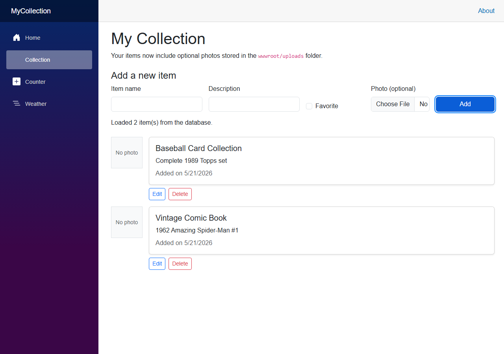

# Module 9: Photo Capture & Upload

[← Previous Module](08-aspire.md) | [Back to README](../README.md)

In this module, you'll add photo upload to your `MyCollection` app. You already have full CRUD working with Entity Framework Core and SQLite from Module 6. Now we're going to extend the `CollectionItem` model with a photo field, build an upload form using Blazor's `InputFile` component, save images to the server, and display them as thumbnails in your collection list.

By the end, each item can optionally have a photo that persists across app restarts — just like the other fields in the database.

---

## 1. Why Photos Matter for Your Collection

**Expected outcome:** You understand why adding photos improves the collection app and what this module will build.

Text descriptions are useful. A visual record makes a collection app genuinely useful. Instead of scrolling through a list of names and notes, you can see what each item actually looks like at a glance.

That is the practical motivation. There is also a technical one.

Photo upload is one of the most common tasks in real-world web development. Nearly every app that lets users add content — profiles, product listings, portfolios — needs file upload at some point. Learning it now in a Blazor context means you've seen the pattern for real.

### What you will build

By the end of this module:

- Each collection item can have an optional photo
- A file picker appears in the add-item form
- Uploaded images are saved to `wwwroot/uploads/` on the server
- Each item in the list shows a thumbnail of its photo, or a placeholder if no photo has been added
- Files are validated for size and type before being saved
- The Home page shows a QR code for your dev tunnel URL so attendees can scan it with a phone and open the app directly

### The connection to Module 10

Module 10 (NServiceBus) will build on exactly what you create here. One of the things it demonstrates is moving the follow-up image processing work into a background message handler — so the browser gets a fast response while the thumbnail work continues asynchronously. That pattern only makes sense once you have seen the direct approach in this module first.

---

## 2. Adding PhotoFileName to the CollectionItem Model

**Expected outcome:** The `CollectionItem` class has a new `PhotoFileName` nullable string property.

You are storing a file **name**, not the file itself. The image file will live on disk in `wwwroot/uploads/`, and the database will store just the filename so you can build a URL to display it.

### Why a string, not the image data?

You have two options when associating an image with a database record:

1. Store the binary image bytes directly in the database column
2. Store the image on disk and save only the filename in the database

For this workshop, option 2 is the right choice:

- Storing binary data in SQLite works for small test images, but it bloats the database quickly and makes every query slower because image data is loaded even when you do not need it
- Files on disk are served directly by ASP.NET Core's static files middleware without any C# code involved in the request
- If you ever want to move images to cloud storage later, you change only the save and URL logic — the model and database column stay the same

Open `MyCollection.Models\CollectionItem.cs` and add the new property:

`MyCollection.Models\CollectionItem.cs`

```csharp
namespace MyCollection.Models;

public class CollectionItem
{
    public int Id { get; set; }
    public string Name { get; set; } = string.Empty;
    public string Description { get; set; } = string.Empty;
    public DateTime DateAdded { get; set; } = DateTime.Today;
    public bool IsFavorite { get; set; }
    public string? PhotoFileName { get; set; }
}
```

The `?` after `string` means the property is **nullable** — it can hold either a filename string or `null`. That is exactly what you want: items added before this module have no photo, and `null` represents that correctly.

> **Nullable reference types in C#:** Value types like `int` and `bool` always hold a value. Reference types like `string` can be `null` — meaning "nothing here." Adding `?` makes that possibility explicit in the type system and signals to other code that it should check before using the value. If `PhotoFileName` is `null`, no photo has been uploaded for that item.

You will not run the EF Core migration yet. Write the application code in sections 3 through 5 first, then create and run the migration in section 6 once everything is in place.

---

## 3. Building the File Upload Component in Blazor

**Expected outcome:** Your `Collection.razor` page has an `InputFile` control in the add-item form and a C# event handler that captures the selected file.

Blazor provides a built-in component called `InputFile`. It wraps the HTML `<input type="file">` element and gives you a typed C# object to work with instead of raw browser events.

When the user selects a file, `InputFile` fires an `OnChange` event with an `InputFileChangeEventArgs` argument. From that argument you get an `IBrowserFile` — an interface representing the selected file with properties for its name, size, content type, and a readable stream of its bytes.

### Adding InputFile to the form

Here is the `InputFile` element to add inside your add-item row:

```razor
<div class="col-md-2">
    <label for="newItemPhoto" class="form-label">Photo (optional)</label>
    <InputFile id="newItemPhoto" OnChange="OnNewFileSelected" accept="image/*" class="form-control" />
</div>
```

Three things to notice:

- `OnChange="OnNewFileSelected"` wires the event to a C# method you will write in `@code`
- `accept="image/*"` tells the browser to filter the file picker to image files — this is a user experience hint only, not security; server-side validation in section 7 is what actually enforces the restriction
- The `id` attribute links to the `for` on the label, which is standard accessible HTML form practice

### The event handler in @code

Add this field and method to the `@code` block:

```csharp
private IBrowserFile? selectedFile;

private void OnNewFileSelected(InputFileChangeEventArgs e)
{
    selectedFile = e.File;
}
```

`e.File` gives you the first file the user selected. You store it in `selectedFile` so the Add button handler can access it.

### Why store the file reference?

`InputFile` does not upload the file automatically when the user picks it. It gives you a reference to a browser file object. You decide when and how to read it. Storing the reference in a field means you can validate and save the file as part of the same `AddItemAsync` method that creates the database row — keeping the add-item logic in one place rather than split across events.

---

## 4. Handling Uploaded Files on the Server

**Expected outcome:** You have a `SavePhotoAsync` method that accepts an `IBrowserFile`, saves it to `wwwroot/uploads/` with a unique filename, and returns the filename string for storage in the database.

### Injecting IWebHostEnvironment

To find where `wwwroot` lives on disk, you need `IWebHostEnvironment`. This service knows the physical path to the web root of your application. Add it to the inject directives at the top of `Collection.razor`:

```razor
@inject IWebHostEnvironment Env
```

`IWebHostEnvironment` is registered automatically by ASP.NET Core — nothing needs to be added to `Program.cs`.

### Unique filenames with Guid

If two users upload files with the same name — `photo.jpg`, for example — the second upload overwrites the first. That is silent data loss.

The solution is to generate a new, unique name for every upload. `Guid.NewGuid()` returns a value that is statistically guaranteed to be unique across all machines and all time:

```text
3f4a1b2c-9d8e-7f6a-5b4c-3d2e1f0a9b8c.jpg
```

You keep the original file extension so the browser can serve the file correctly as an image, but the name itself is entirely new and collision-free.

### The SavePhotoAsync method

Add this method to the `@code` block. Notice that `MaxFileSize` is referenced here — you will define it as a constant in section 7 alongside the rest of the validation logic.

```csharp
private async Task<string?> SavePhotoAsync(IBrowserFile file)
{
    var uploadsPath = Path.Combine(Env.WebRootPath, "uploads");
    Directory.CreateDirectory(uploadsPath);

    var extension = Path.GetExtension(file.Name);
    var fileName = $"{Guid.NewGuid()}{extension}";
    var filePath = Path.Combine(uploadsPath, fileName);

    await using var stream = File.OpenWrite(filePath);
    await file.OpenReadStream(MaxFileSize).CopyToAsync(stream);

    return fileName;
}
```

Step by step:

1. `Path.Combine(Env.WebRootPath, "uploads")` builds the full disk path to the uploads folder
2. `Directory.CreateDirectory(uploadsPath)` creates the folder if it does not exist — safe to call even if the folder is already there
3. `Path.GetExtension(file.Name)` extracts the extension from the original filename (e.g., `.jpg`, `.png`)
4. `Guid.NewGuid()` generates the unique base name
5. `File.OpenWrite(filePath)` opens a write stream to the new file on disk
6. `file.OpenReadStream(MaxFileSize).CopyToAsync(stream)` reads the uploaded bytes and copies them to disk

The `await using` on the stream ensures it is properly closed and flushed even if an exception occurs.

### Calling SavePhotoAsync from AddItemAsync

Update `AddItemAsync` to save the photo before inserting the database row:

```csharp
private async Task AddItemAsync()
{
    if (string.IsNullOrWhiteSpace(newItem.Name))
    {
        statusMessage = "Enter a name before adding an item.";
        return;
    }

    if (selectedFile is not null)
    {
        var fileName = await SavePhotoAsync(selectedFile);
        if (fileName is null)
        {
            return;
        }
        newItem.PhotoFileName = fileName;
    }

    newItem.DateAdded = DateTime.Today;
    Context.CollectionItems.Add(newItem);
    await Context.SaveChangesAsync();

    statusMessage = $"Added: {newItem.Name}";
    newItem = new CollectionItem { DateAdded = DateTime.Today };
    selectedFile = null;
    await LoadItemsAsync();
}
```

Two cases to understand:

- If `selectedFile` is `null` (the user did not pick a file), the item is saved with `PhotoFileName` as `null`. Photos are optional — this is correct.
- If `SavePhotoAsync` returns `null`, validation failed and `statusMessage` is already set with the error text. The early `return` prevents the item from being added when the photo is invalid.

---

### What just happened?

You now have the full server-side upload path:

1. User selects a file in the `InputFile` component
2. Blazor calls `OnNewFileSelected`, which stores the `IBrowserFile` reference
3. User clicks **Add**
4. `AddItemAsync` calls `SavePhotoAsync` if a file was selected
5. `SavePhotoAsync` generates a unique filename, writes the bytes to `wwwroot/uploads/`, and returns the filename
6. The filename is assigned to `newItem.PhotoFileName`
7. EF Core saves the item — including the filename — to SQLite

The file is on disk. The filename is in the database. The two are linked only by that filename string. If you ever need to find the file for a given item, you look up `PhotoFileName` in the database and combine it with the uploads path.

---

## 5. Displaying Uploaded Photos in the UI

**Expected outcome:** The collection list shows a thumbnail for items that have a photo, and a consistent placeholder for items that do not.

Serving images from `wwwroot` is built into ASP.NET Core. The static files middleware handles any file under `wwwroot` automatically — no routing or controller code is needed. A file saved at `wwwroot/uploads/abc123.jpg` is available at the URL `/uploads/abc123.jpg`.

### Adding the photo display to the item list

Replace the `@foreach` loop in your collection list with this updated version that includes the thumbnail column:

```razor
@foreach (var item in items)
{
    <div class="mb-3 d-flex gap-3 align-items-start">
        <div>
            @if (item.PhotoFileName is not null)
            {
                
            }
            else
            {
                <div class="bg-light border d-flex align-items-center justify-content-center"
                     style="width: 80px; height: 80px;">
                    <span class="text-muted small">No photo</span>
                </div>
            }
        </div>
        <div class="flex-grow-1">
            <CollectionItemCard Item="item" />
            <div class="d-flex gap-2 mt-2">
                <button class="btn btn-outline-primary btn-sm" @onclick="() => StartEditAsync(item.Id)">
                    Edit
                </button>
                <button class="btn btn-outline-danger btn-sm" @onclick="() => DeleteItemAsync(item.Id)">
                    Delete
                </button>
            </div>
        </div>
    </div>
}
```

Four details worth noting:

- `src="/uploads/@item.PhotoFileName"` builds the URL. The leading `/` ensures the path is always relative to the app root, not to the current page path — important if you later add pages at deeper URL paths
- `alt="@item.Name"` provides an accessible text description of the image for screen readers — always include a meaningful `alt` attribute on images
- `object-fit: cover` crops the photo to fill the thumbnail square without distorting the aspect ratio — a photo taken in portrait orientation will still look good at 80×80
- The `else` block renders a gray placeholder box at the same size so the layout stays consistent whether an item has a photo or not

---

## 6. Updating the Database Schema for Photo Metadata

**Expected outcome:** You have run an EF Core migration that adds a nullable `PhotoFileName` column to the `CollectionItems` table, and the app runs successfully.

The model has a new property. EF Core needs a migration to reflect that change in the database.

You learned this workflow in Module 6. The steps are identical: create a migration file describing the change, then apply it to the SQLite database.

From the `MyCollection` folder in your terminal:

```bash
dotnet ef migrations add AddPhotoFileName
```

Then apply it:

```bash
dotnet ef database update
```

EF Core generates a new migration file in your `Migrations` folder. The key line inside it will look something like this:

```csharp
migrationBuilder.AddColumn<string>(
    name: "PhotoFileName",
    table: "CollectionItems",
    type: "TEXT",
    nullable: true);
```

The `nullable: true` matches the `string?` type on the model property. Any rows already in the database will have `NULL` in the new column — which is exactly right. Those items existed before the photo feature, so they simply have no photo.

### What just happened?

- The `CollectionItems` table now has a `PhotoFileName` column
- Existing rows have `NULL` in that column — correct and expected
- New items can hold either `NULL` (no photo chosen) or a Guid-based filename string
- The migration file is source code — commit it along with the rest of your changes

### Creating the uploads folder for Git

The app creates `wwwroot/uploads/` automatically the first time a photo is saved (`Directory.CreateDirectory` handles this). However, it is good practice to create the folder explicitly so it exists when the app starts for the first time and so Git is aware of it.

Create the folder:

```bash
mkdir MyCollection\wwwroot\uploads
```

Then create an empty `.gitkeep` file inside it so Git can track the directory even when it is otherwise empty:

```powershell
New-Item -ItemType File MyCollection\wwwroot\uploads\.gitkeep
```

You do **not** want to commit uploaded photos to your repository — those are user data, not source code. Add these lines to your `.gitignore` file:

```text
# Uploaded photos — not source code
MyCollection/wwwroot/uploads/*
!MyCollection/wwwroot/uploads/.gitkeep
```

The `!` line is an exception rule that tells Git to still track `.gitkeep` even though the pattern above excludes everything else in that folder.

---

## 7. Basic File Validation

**Expected outcome:** Your upload code rejects files larger than 5 MB and files that are not images, and shows a clear error message in both cases.

File validation happens in two layers:

- The **browser** can filter which files appear in the file picker via the `accept` attribute you added in section 3
- The **server** validates again before writing anything to disk — this is the layer that actually matters

Never rely on the browser to enforce limits. The `accept` attribute is a convenience for ordinary users. Anyone with basic technical knowledge can bypass it. Your server-side check is not optional.

### Constants for validation limits

Add these two fields near the top of your `@code` block, before the instance fields:

```csharp
private static readonly string[] AllowedContentTypes =
[
    "image/jpeg",
    "image/png",
    "image/gif",
    "image/webp"
];

private const long MaxFileSize = 5 * 1024 * 1024; // 5 MB
```

Using a named constant for the size limit means you only need to change it in one place if the limit ever changes. The allowed content types are similarly collected where they are easy to find and update.

### The complete SavePhotoAsync method with validation

Here is the full `SavePhotoAsync` method, now including the validation checks before any disk I/O occurs:

```csharp
private async Task<string?> SavePhotoAsync(IBrowserFile file)
{
    if (file.Size > MaxFileSize)
    {
        statusMessage = "File is too large. Maximum allowed size is 5 MB.";
        return null;
    }

    if (!AllowedContentTypes.Contains(file.ContentType))
    {
        statusMessage = "Only JPEG, PNG, GIF, and WebP images are allowed.";
        return null;
    }

    var uploadsPath = Path.Combine(Env.WebRootPath, "uploads");
    Directory.CreateDirectory(uploadsPath);

    var extension = Path.GetExtension(file.Name);
    var fileName = $"{Guid.NewGuid()}{extension}";
    var filePath = Path.Combine(uploadsPath, fileName);

    await using var stream = File.OpenWrite(filePath);
    await file.OpenReadStream(MaxFileSize).CopyToAsync(stream);

    return fileName;
}
```

The validation order matters:

1. Check the file size first — `IBrowserFile.Size` is a property Blazor already knows without reading any bytes from the browser
2. Check the content type — `IBrowserFile.ContentType` is also known immediately without reading file data
3. Only after both checks pass do you open streams and write to disk

This means that if a user tries to upload a 50 MB video file, you reject it immediately and never waste any I/O reading the content.

### Why content type validation is not foolproof

Content type (also called MIME type) is just a string sent by the browser. A browser typically sets it correctly based on the file extension, but the value can be anything. Checking `image/jpeg` confirms the browser is claiming the file is a JPEG — it does not prove the file actually is one.

For this workshop, content type validation is appropriate. It stops accidents and casual misuse. A production app that needs stronger guarantees would also inspect the file's magic bytes — the first few bytes of a JPEG always start with `FF D8 FF`, for example — to confirm the format independently of what the browser says. That technique is called magic number validation and is beyond the scope of this module.

---

## 8. Taking Photos Directly with a Device Camera

**Expected outcome:** You understand the HTML5 `capture` attribute and know how to apply it to `InputFile` if you want mobile users to go directly to the camera.

On a mobile device, `<input type="file" accept="image/*">` typically gives the user a choice: browse their photo gallery or open the camera. The HTML5 `capture` attribute takes that further by going directly to the camera:

```html
<input type="file" accept="image/*" capture="environment" />
```

The two values are:

- `capture="environment"` — opens the rear-facing camera (the primary camera on most phones)
- `capture="user"` — opens the front-facing camera

### Using capture with Blazor's InputFile

`InputFile` renders a standard `<input type="file">` element, and it passes through any extra HTML attributes you provide:

```razor
<InputFile id="newItemPhoto"
           OnChange="OnNewFileSelected"
           accept="image/*"
           capture="environment"
           class="form-control" />
```

No changes to the `@code` block or the server-side code are needed. The upload and validation flow is identical regardless of where the image comes from.

### The trade-off

When `capture` is present, many mobile browsers skip the file library entirely and open the camera directly. That means the user can only take a new photo — they cannot select an existing one from their gallery. On desktop browsers, `capture` is ignored.

For this workshop, leaving `capture` off (as in sections 3 and 4) is the better default. Users on desktop pick from files; users on mobile get their device's standard choice between gallery and camera. Adding `capture="environment"` is something you would do for a specific use case where you always want a fresh photo.

---

## 9. Testing the Upload Flow End-to-End

**Expected outcome:** You can add an item with a photo, see the thumbnail in the list, and verify the data survives an app restart.

Before testing, confirm the migration has been applied:

```bash
dotnet ef database update
```

Then start the app:

```bash
dotnet run
```

Navigate to `/collection` and you should see the updated form with the photo file picker alongside the existing fields:



Work through these test cases.

### Happy path

1. Fill in a name and description for a new item
2. Click the photo file picker and select a small JPEG or PNG image (under 5 MB)
3. Click **Add**
4. The item appears in the list with its photo thumbnail
5. Stop the app with `Ctrl+C` and start it again with `dotnet run`
6. Navigate back to `/collection`

If the thumbnail is still there after the restart, both the file system and the database are working correctly. The file survived because it is on disk. The filename survived because it is in SQLite.

### Edge cases to test

**No photo selected:**
Add an item without selecting a file. The item should appear in the list showing the "No photo" placeholder. No errors should occur.

**File too large:**
Try to upload an image file larger than 5 MB. The status message should say the file is too large, and the item should not be added.

**Wrong file type:**
Select a `.txt` or `.pdf` file from the file picker (you may need to change the file type filter in the dialog). The status message should say only image files are allowed.

> **Tip for finding a large test file:** Screenshot tools often produce uncompressed PNG files several megabytes in size. Many stock photo sites also offer high-resolution images in the 8–20 MB range. Any file above 5 MB will trigger the size check.

### Verifying files on disk

After uploading a photo, look in the uploads folder:

```text
MyCollection\wwwroot\uploads\
    3f4a1b2c-9d8e-7f6a-5b4c-3d2e1f0a9b8c.jpg
```

You can open that file in any image viewer to confirm it is a valid copy of what you uploaded.

If you want to inspect the database record at the same time, open `MyCollection.db` in DB Browser for SQLite (the optional tool mentioned in Module 6) and look at the `CollectionItems` table. The `PhotoFileName` column for that item should contain the same Guid-based filename.

---

## 10. Committing Your Changes to Git

**Expected outcome:** Your photo upload additions are committed to your repository with a descriptive commit message.

Module 5 taught you the Git workflow. This module has added several meaningful files and changes, so take a moment to review before staging everything.

### Review the changed files

```bash
git status
```

You should see output similar to:

```text
Changes not staged for commit:
    modified:   MyCollection.Models/CollectionItem.cs
    modified:   MyCollection/Components/Pages/Collection.razor
    modified:   .gitignore

Untracked files:
    MyCollection/Migrations/XXXXXXXX_AddPhotoFileName.cs
    MyCollection/Migrations/XXXXXXXX_AddPhotoFileName.Designer.cs
    MyCollection/wwwroot/uploads/.gitkeep
```

The `MyCollection.db` file should not appear if your `.gitignore` from Module 6 is in place. The uploaded images in `wwwroot/uploads/` should not appear either, because of the exclusion pattern you added in section 6.

`CollectionContextModelSnapshot.cs` in the `Migrations` folder will show as modified — EF Core updates it to reflect the current database schema each time you add a migration.

### Stage and commit

Stage everything:

```bash
git add .
```

Write a commit message that describes what this change does. A multi-line message is appropriate here — the first line is a short summary, and the lines after the blank line give detail:

```bash
git commit -m "Add photo upload to collection items

- Add PhotoFileName (nullable string) to CollectionItem model
- Add EF Core migration AddPhotoFileName for the new column
- Add InputFile component to the add-item form
- Save uploaded photos to wwwroot/uploads with Guid filenames
- Validate file size (5 MB max) and type (JPEG, PNG, GIF, WebP)
- Display photo thumbnails in the collection list
- Add wwwroot/uploads/.gitkeep and gitignore rule for uploaded files"
```

This kind of descriptive message is useful when you look at the repository history weeks later and want to understand what a commit actually changed without reading every file.

### Pushing to GitHub

If you have a remote set up from Module 5:

```bash
git push
```

---

## Complete Updated Collection.razor

Here is the full `Collection.razor` file incorporating all changes from this module. Use this as a reference if any section of your component does not match what is expected.

`MyCollection\Components\Pages\Collection.razor`

```razor
@page "/collection"
@rendermode InteractiveServer
@using Microsoft.EntityFrameworkCore
@using MyCollection.Data
@using MyCollection.Models
@inject CollectionContext Context
@inject IWebHostEnvironment Env

<PageTitle>My Collection</PageTitle>

<h1>My Collection</h1>
<p>Your items now include optional photos stored in the <code>wwwroot/uploads</code> folder.</p>

<h2 class="h4 mt-4">Add a new item</h2>
<div class="row g-3 align-items-end">
    <div class="col-md-3">
        <label for="newItemName" class="form-label">Item name</label>
        <input id="newItemName" class="form-control" @bind="newItem.Name" />
    </div>
    <div class="col-md-3">
        <label for="newItemDescription" class="form-label">Description</label>
        <input id="newItemDescription" class="form-control" @bind="newItem.Description" />
    </div>
    <div class="col-md-2">
        <div class="form-check mt-4">
            <input id="newItemFavorite" type="checkbox" class="form-check-input" @bind="newItem.IsFavorite" />
            <label for="newItemFavorite" class="form-check-label">Favorite</label>
        </div>
    </div>
    <div class="col-md-2">
        <label for="newItemPhoto" class="form-label">Photo (optional)</label>
        <InputFile id="newItemPhoto" OnChange="OnNewFileSelected" accept="image/*" class="form-control" />
    </div>
    <div class="col-md-2">
        <button class="btn btn-primary w-100" @onclick="AddItemAsync">Add</button>
    </div>
</div>

<p class="mt-3">@statusMessage</p>

@if (editItem is not null)
{
    <section class="card mt-4">
        <div class="card-body">
            <h2 class="h5">Edit item</h2>
            <div class="row g-3 align-items-end">
                <div class="col-md-4">
                    <label for="editItemName" class="form-label">Item name</label>
                    <input id="editItemName" class="form-control" @bind="editItem.Name" />
                </div>
                <div class="col-md-5">
                    <label for="editItemDescription" class="form-label">Description</label>
                    <input id="editItemDescription" class="form-control" @bind="editItem.Description" />
                </div>
                <div class="col-md-2">
                    <div class="form-check">
                        <input id="editItemFavorite" type="checkbox" class="form-check-input" @bind="editItem.IsFavorite" />
                        <label for="editItemFavorite" class="form-check-label">Favorite</label>
                    </div>
                </div>
                <div class="col-md-1 d-flex gap-2">
                    <button class="btn btn-success" @onclick="SaveEditAsync">Save</button>
                    <button class="btn btn-outline-secondary" @onclick="CancelEdit">Cancel</button>
                </div>
            </div>
        </div>
    </section>
}

@if (items.Count == 0)
{
    <p class="mt-4">No items in the database yet. Add your first one above.</p>
}
else
{
    <div class="mt-4">
        @foreach (var item in items)
        {
            <div class="mb-3 d-flex gap-3 align-items-start">
                <div>
                    @if (item.PhotoFileName is not null)
                    {
                        
                    }
                    else
                    {
                        <div class="bg-light border d-flex align-items-center justify-content-center"
                             style="width: 80px; height: 80px;">
                            <span class="text-muted small">No photo</span>
                        </div>
                    }
                </div>
                <div class="flex-grow-1">
                    <CollectionItemCard Item="item" />
                    <div class="d-flex gap-2 mt-2">
                        <button class="btn btn-outline-primary btn-sm" @onclick="() => StartEditAsync(item.Id)">
                            Edit
                        </button>
                        <button class="btn btn-outline-danger btn-sm" @onclick="() => DeleteItemAsync(item.Id)">
                            Delete
                        </button>
                    </div>
                </div>
            </div>
        }
    </div>
}

@code {
    private static readonly string[] AllowedContentTypes =
    [
        "image/jpeg",
        "image/png",
        "image/gif",
        "image/webp"
    ];

    private const long MaxFileSize = 5 * 1024 * 1024; // 5 MB

    private List<CollectionItem> items = new();
    private CollectionItem newItem = new() { DateAdded = DateTime.Today };
    private CollectionItem? editItem;
    private string statusMessage = "Loading items from the database...";
    private IBrowserFile? selectedFile;

    protected override async Task OnInitializedAsync()
    {
        await LoadItemsAsync();
    }

    private void OnNewFileSelected(InputFileChangeEventArgs e)
    {
        selectedFile = e.File;
    }

    private async Task LoadItemsAsync()
    {
        items = await Context.CollectionItems
            .OrderByDescending(item => item.DateAdded)
            .ThenBy(item => item.Name)
            .ToListAsync();

        statusMessage = items.Count == 0
            ? "Your database is ready. Add your first item."
            : $"Loaded {items.Count} item(s) from the database.";
    }

    private async Task<string?> SavePhotoAsync(IBrowserFile file)
    {
        if (file.Size > MaxFileSize)
        {
            statusMessage = "File is too large. Maximum allowed size is 5 MB.";
            return null;
        }

        if (!AllowedContentTypes.Contains(file.ContentType))
        {
            statusMessage = "Only JPEG, PNG, GIF, and WebP images are allowed.";
            return null;
        }

        var uploadsPath = Path.Combine(Env.WebRootPath, "uploads");
        Directory.CreateDirectory(uploadsPath);

        var extension = Path.GetExtension(file.Name);
        var fileName = $"{Guid.NewGuid()}{extension}";
        var filePath = Path.Combine(uploadsPath, fileName);

        await using var stream = File.OpenWrite(filePath);
        await file.OpenReadStream(MaxFileSize).CopyToAsync(stream);

        return fileName;
    }

    private async Task AddItemAsync()
    {
        if (string.IsNullOrWhiteSpace(newItem.Name))
        {
            statusMessage = "Enter a name before adding an item.";
            return;
        }

        if (selectedFile is not null)
        {
            var fileName = await SavePhotoAsync(selectedFile);
            if (fileName is null)
            {
                return;
            }
            newItem.PhotoFileName = fileName;
        }

        newItem.DateAdded = DateTime.Today;
        Context.CollectionItems.Add(newItem);
        await Context.SaveChangesAsync();

        statusMessage = $"Added: {newItem.Name}";
        newItem = new CollectionItem { DateAdded = DateTime.Today };
        selectedFile = null;
        await LoadItemsAsync();
    }

    private async Task StartEditAsync(int id)
    {
        editItem = await Context.CollectionItems
            .AsNoTracking()
            .FirstOrDefaultAsync(item => item.Id == id);

        if (editItem is null)
        {
            statusMessage = "That item could not be found.";
        }
    }

    private void CancelEdit()
    {
        editItem = null;
        statusMessage = "Edit cancelled.";
    }

    private async Task SaveEditAsync()
    {
        if (editItem is null)
        {
            return;
        }

        if (string.IsNullOrWhiteSpace(editItem.Name))
        {
            statusMessage = "Enter a name before saving the item.";
            return;
        }

        var itemToUpdate = await Context.CollectionItems
            .FirstOrDefaultAsync(item => item.Id == editItem.Id);

        if (itemToUpdate is null)
        {
            statusMessage = "That item could not be found.";
            return;
        }

        itemToUpdate.Name = editItem.Name;
        itemToUpdate.Description = editItem.Description;
        itemToUpdate.IsFavorite = editItem.IsFavorite;

        await Context.SaveChangesAsync();

        statusMessage = $"Updated: {itemToUpdate.Name}";
        editItem = null;
        await LoadItemsAsync();
    }

    private async Task DeleteItemAsync(int id)
    {
        var itemToDelete = await Context.CollectionItems.FindAsync(id);

        if (itemToDelete is null)
        {
            statusMessage = "That item could not be found.";
            return;
        }

        Context.CollectionItems.Remove(itemToDelete);
        await Context.SaveChangesAsync();

        if (editItem?.Id == id)
        {
            editItem = null;
        }

        statusMessage = $"Deleted: {itemToDelete.Name}";
        await LoadItemsAsync();
    }
}
```

---

## Next Module

[Module 10: Background Processing with NServiceBus →](10-nservicebus.md)
