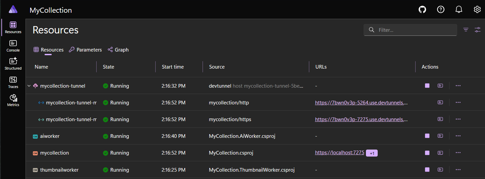

# Module 10: Intelligent Image Analysis with AI

[← Previous Module](09-nservicebus.md) | [Back to README](../README.md)

In this module, you'll add a **second console application** to the `MyCollection` solution. This new project is another **NServiceBus endpoint**, and its job is different from the thumbnail worker you built in Module 9.

The thumbnail worker was about image processing.
This worker is about **image understanding**.

When a new photo is uploaded and processed, the AI worker will receive an event, load the image, send it to an AI model through **Microsoft Agent Framework building blocks in `Microsoft.Extensions.AI`**, and generate a short description plus tags for the collection item.

By the end of this module, your app will support this full flow:

1. A user uploads a photo
2. The Module 9 worker creates a thumbnail and converts the image to WebP
3. That worker publishes an `AnalyzeCollectionImage` event
4. The new AI worker handles the event
5. The AI model describes the item and suggests tags
6. The result is stored with the collection item
7. The Blazor UI can display the AI-generated description

This is a good beginner-scale AI feature because it is practical, visible, and easy to explain. You are not adding a vague “chatbot.” You are adding a concrete workflow improvement to the app.

---

## 1. Why AI for Collections?

**Expected outcome:** You understand why image analysis is a strong fit for `MyCollection` and what value it adds to the app.

A collection app gets more useful when it helps the user organize what they uploaded.

That is exactly what AI can do here.

Instead of asking the user to type every detail manually, your app can look at the image and produce:

- A short plain-language description
- A few suggested tags
- A better accessibility experience for people who benefit from image descriptions
- A faster workflow when adding many items

### Why this is a good workshop scenario

This module uses AI in a way that feels grounded:

- The input is real user data: an uploaded image
- The output goes back into the app as normal application data
- The work happens in the background, not inside the web request
- The result is easy to verify in the UI, logs, or dashboard

That matters.
A lot of AI examples stop at printing text to a console.
This one takes the next step and shows how AI becomes part of an actual feature. That's what I want you to take away from this module.

### Why background processing still matters

You could call the AI model directly from the Blazor app after upload.
That would work technically, but it would be the wrong teaching move.

Model calls can take time.
They can fail.
They can be retried.
They belong naturally in the same message-driven architecture you introduced in Module 9.

That gives you a cleaner pipeline:

- The web app accepts the upload
- The thumbnail worker prepares the image
- The AI worker analyzes the image
- The app stores the result when it is ready

Each endpoint has one responsibility.
That is a healthier design than making the UI do everything.

### Accessibility is part of the value

AI-generated descriptions are not only about convenience.
They can also help with accessibility.

If your app shows an image plus a generated description, users who cannot easily interpret the image still get meaningful context. In a real production app you would still review accessibility carefully and avoid treating AI output as perfect, but even this beginner version demonstrates the right direction.

### What just happened

You established the feature goal clearly: AI is not a gimmick here. It saves time, improves discoverability, and makes the collection app more usable.

---

## 2. Microsoft Agent Framework Overview

**Expected outcome:** You understand what `Microsoft.Extensions.AI` gives you and why it is a good abstraction for this worker.

For this module, you will use the **Microsoft Agent Framework building blocks in `Microsoft.Extensions.AI`**.

That phrasing matters.
You're not building a giant autonomous agent system.
You're using the pieces of the framework that make model access clean, testable, and provider-neutral.

### The important abstraction: `IChatClient`

The core type you care about is:

```csharp
using Microsoft.Extensions.AI;

IChatClient chatClient;
```

`IChatClient` is an abstraction over chat-capable AI models.
It gives your code one consistent surface for:

- Sending prompts
- Sending conversation history
- Sending multi-modal content such as text and images
- Receiving model responses

That means your application code does **not** need to be tightly coupled to one provider. And that's exactly how I like to build things.

### Why that is useful in this workshop

In this module, your first provider is **GitHub Models** because it is easy for workshop attendees to access with a GitHub token.

Later, if you want to move to:

- Azure AI Foundry
- Azure OpenAI
- Another OpenAI-compatible endpoint

…you shouldn't have to rewrite your handler logic.

That's the exact benefit of `Microsoft.Extensions.AI`.
You can keep the application logic centered on `IChatClient` and swap the underlying provider configuration.

### The provider-specific layer still exists

Abstractions are useful, but they are not magic.
You still need a concrete client underneath.

In this module, the concrete stack is:

- `OpenAI` package for the OpenAI-compatible client
- `Microsoft.Extensions.AI.OpenAI` package for the bridge to `IChatClient`
- `Microsoft.Extensions.AI` for the shared abstractions and middleware pipeline

That means the model call will be made through an OpenAI-compatible endpoint, but your business logic will depend only on `IChatClient`.

### Why this counts as “Agent Framework” here

A beginner-friendly way to explain this is:

- `Microsoft.Extensions.AI` gives you **agent-friendly primitives**
- `IChatClient` is the model interface
- `ChatClientBuilder` lets you add middleware such as logging or telemetry
- The worker becomes a small, focused AI-powered service

That's enough for this workshop.
You're teaching the right architectural shape without dragging students into unnecessary complexity.

### What just happened

You separated the abstraction from the provider. The worker will depend on `IChatClient`, while configuration decides whether the underlying model is GitHub Models or an instructor-provided endpoint.

---

## 3. Creating the AI Worker Console App

**Expected outcome:** You create a new console project named `MyCollection.AiWorker`, add it to the solution, and install the packages it needs.

This module adds a **second** console app.
It is a separate NServiceBus endpoint, just like the thumbnail worker from Module 9.

From the solution root, run:

```bash
dotnet new console -n MyCollection.AiWorker
dotnet sln .\MyCollection.sln add .\MyCollection.AiWorker\MyCollection.AiWorker.csproj
```

### Add project references

This worker should reference:

- `MyCollection.ServiceDefaults` so it participates in Aspire telemetry and health conventions
- `MyCollection.Messages` so it can handle the shared NServiceBus event contracts from Module 9

Run:

```bash
dotnet add .\MyCollection.AiWorker\MyCollection.AiWorker.csproj reference .\MyCollection.ServiceDefaults\MyCollection.ServiceDefaults.csproj
dotnet add .\MyCollection.AiWorker\MyCollection.AiWorker.csproj reference .\MyCollection.Messages\MyCollection.Messages.csproj
```

> If your shared contracts project from Module 9 has a different name, use that project instead. The important part is that both workers and the web app share the same message contract types.

### Add the NuGet packages

Install the packages explicitly so the project file is easy to read:

```bash
dotnet add .\MyCollection.AiWorker\MyCollection.AiWorker.csproj package Microsoft.Extensions.AI --version 10.6.0
dotnet add .\MyCollection.AiWorker\MyCollection.AiWorker.csproj package Microsoft.Extensions.AI.OpenAI --version 10.6.0
dotnet add .\MyCollection.AiWorker\MyCollection.AiWorker.csproj package OpenAI --version 2.10.0
dotnet add .\MyCollection.AiWorker\MyCollection.AiWorker.csproj package NServiceBus --version 10.1.4
dotnet add .\MyCollection.AiWorker\MyCollection.AiWorker.csproj package NServiceBus.Extensions.Hosting --version 4.0.1
dotnet add .\MyCollection.AiWorker\MyCollection.AiWorker.csproj package Microsoft.Data.Sqlite --version 10.0.8
```

### What each package is doing

- `Microsoft.Extensions.AI` gives you `IChatClient`, `ChatMessage`, `DataContent`, and the middleware builder
- `Microsoft.Extensions.AI.OpenAI` bridges the OpenAI client into the `IChatClient` abstraction
- `OpenAI` provides the concrete OpenAI-compatible chat client and endpoint configuration
- `NServiceBus` is the core message framework
- `NServiceBus.Extensions.Hosting` connects the endpoint to the .NET Generic Host
- `Microsoft.Data.Sqlite` lets the worker update the SQLite database directly

### The project file

Your new worker project should look like this:

`MyCollection.AiWorker\MyCollection.AiWorker.csproj`

```xml
<Project Sdk="Microsoft.NET.Sdk">
  <PropertyGroup>
    <OutputType>Exe</OutputType>
    <TargetFramework>net10.0</TargetFramework>
    <ImplicitUsings>enable</ImplicitUsings>
    <Nullable>enable</Nullable>
  </PropertyGroup>

  <ItemGroup>
    <PackageReference Include="Microsoft.Data.Sqlite" Version="10.0.8" />
    <PackageReference Include="Microsoft.Extensions.AI" Version="10.6.0" />
    <PackageReference Include="Microsoft.Extensions.AI.OpenAI" Version="10.6.0" />
    <PackageReference Include="NServiceBus" Version="10.1.4" />
    <PackageReference Include="NServiceBus.Extensions.Hosting" Version="4.0.1" />
    <PackageReference Include="OpenAI" Version="2.10.0" />
  </ItemGroup>

  <ItemGroup>
    <ProjectReference Include="..\MyCollection.Messages\MyCollection.Messages.csproj" />
    <ProjectReference Include="..\MyCollection.ServiceDefaults\MyCollection.ServiceDefaults.csproj" />
  </ItemGroup>
</Project>
```

### A note about naming

The name `MyCollection.AiWorker` tells you exactly what the process does:

- `MyCollection` ties it to the solution
- `Ai` describes the business job — this worker handles AI tasks
- `Worker` makes it obvious that this is a background process

That kind of naming matters in multi-process systems.
When you open the Aspire dashboard later, clear names make the system easier to read.

### What just happened

You created a second background endpoint and gave it the packages needed to talk to both NServiceBus and an AI model. At this point, the project exists, but it still has no behavior.

---

## 4. Configuring the AI Client

**Expected outcome:** The worker can read model settings from configuration and connect to GitHub Models first, with a clean fallback path for an instructor-provided endpoint.

This module starts with **GitHub Models** because it is the easiest workshop-friendly endpoint.

GitHub Models exposes an OpenAI-compatible API, which means you can point the OpenAI client at a custom base URL and still use the `Microsoft.Extensions.AI` abstraction on top.

### The GitHub Models setup

You need three values:

- The endpoint base URL
- The model name
- A GitHub personal access token with the `models` scope

For the base URL, use:

```text
https://models.github.ai/inference
```

For the model, start with:

```text
openai/gpt-4.1
```

For the token, create a GitHub personal access token with the `models` scope.

> **Fallback note:** If GitHub Models is unavailable, your instructor will provide an endpoint URL.

That sentence is important because it preserves the workshop flow. The worker code does not need to change if the endpoint remains OpenAI-compatible. You only change configuration.

### Define a small options class

Create a file named `AiOptions.cs`:

`MyCollection.AiWorker\AiOptions.cs`

```csharp
namespace MyCollection.AiWorker;

public sealed class AiOptions
{
    public const string SectionName = "AI";

    public string Endpoint { get; set; } = "https://models.github.ai/inference";
    public string Model { get; set; } = "openai/gpt-4.1";
    public string ApiKey { get; set; } = string.Empty;
}
```

This class is intentionally small.
It holds exactly the configuration the worker needs.

### Why use options instead of hardcoding values?

Because the endpoint is likely to change across environments.

For example:

- A student machine may use GitHub Models
- A classroom demo may use an instructor-provided endpoint
- A future deployed version may use Azure AI Foundry

If the values are in configuration, your handler code stays stable.

### The registration pattern in `Program.cs`

You will bind the `AI` section from configuration and validate it at startup:

```csharp
builder.Services
    .AddOptions<AiOptions>()
    .Bind(builder.Configuration.GetSection(AiOptions.SectionName))
    .Validate(options => Uri.TryCreate(options.Endpoint, UriKind.Absolute, out _), "AI:Endpoint must be a valid absolute URI.")
    .Validate(options => !string.IsNullOrWhiteSpace(options.Model), "AI:Model is required.")
    .Validate(options => !string.IsNullOrWhiteSpace(options.ApiKey), "AI:ApiKey is required.")
    .ValidateOnStart();
```

That gives you a very useful beginner habit:

- Fail fast when configuration is missing
- Show a clear startup error
- Avoid mysterious null reference problems later in a handler

### Build the concrete chat client

The provider-specific part of the worker will look like this:

```csharp
using Azure;
using Microsoft.Extensions.AI;
using OpenAI;
using OpenAI.Chat;

IChatClient innerClient = new ChatClient(
    model: options.Model,
    credential: new ApiKeyCredential(options.ApiKey),
    options: new OpenAIClientOptions
    {
        Endpoint = new Uri(options.Endpoint)
    })
    .AsIChatClient();
```

A few details matter here:

- `ChatClient` comes from the `OpenAI` package
- `OpenAIClientOptions.Endpoint` points it at GitHub Models or another compatible endpoint
- `.AsIChatClient()` converts it into the abstraction your application code will use

### Add middleware with `ChatClientBuilder`

One nice thing about the Microsoft Agent Framework stack is that you can build a pipeline around the client:

```csharp
return new ChatClientBuilder(innerClient)
    .UseLogging(loggerFactory)
    .Build();
```

That keeps the worker easy to reason about:

- The provider client sits at the bottom
- The `IChatClient` abstraction sits on top
- Logging or telemetry can wrap the client without changing handler code

### Configuration outside Aspire

If you want to run the worker outside Aspire, you can use user secrets while developing:

```bash
dotnet user-secrets init --project .\MyCollection.AiWorker\MyCollection.AiWorker.csproj
dotnet user-secrets set AI:Endpoint https://models.github.ai/inference --project .\MyCollection.AiWorker\MyCollection.AiWorker.csproj
dotnet user-secrets set AI:Model openai/gpt-4.1 --project .\MyCollection.AiWorker\MyCollection.AiWorker.csproj
dotnet user-secrets set AI:ApiKey YOUR_GITHUB_MODELS_TOKEN --project .\MyCollection.AiWorker\MyCollection.AiWorker.csproj
```

When running under Aspire, you will inject the same values from the AppHost instead.

### What just happened

You designed the AI connection so the code depends on abstractions and the environment supplies the endpoint details. That is exactly how you want model access to look in a real application.

---

## 5. Defining the Message

**Expected outcome:** You create a shared event named `AnalyzeCollectionImage` that the thumbnail worker can publish and the AI worker can subscribe to.

In Module 9, the first worker created a thumbnail and converted the uploaded image.
Now you need a message that represents the next step in the pipeline.

You could publish the same original upload event again.
You could also publish a follow-up event after the thumbnail exists.

For this workshop, the follow-up event is the cleaner design.

### Why publish after thumbnail processing?

Because the thumbnail worker already did meaningful preparation work.
Publishing after that step gives you a pipeline that reads naturally:

1. Upload requested
2. Thumbnail generated
3. Image ready for AI analysis

That also gives the AI worker a smaller image to analyze, which can reduce cost and latency.

### Create the shared event contract

Add this file to your shared contracts project:

`MyCollection.Messages\AnalyzeCollectionImage.cs`

```csharp
using NServiceBus;

namespace MyCollection.Messages;

public record AnalyzeCollectionImage(
    int CollectionItemId,
    string OriginalImagePath,
    string ThumbnailPath) : IEvent;
```

### Why these properties?

- `CollectionItemId` tells the worker which database row to update
- `OriginalImagePath` gives you a fallback if the thumbnail path is unavailable
- `ThumbnailPath` lets the AI worker prefer the smaller processed image

This is a nice example of a message contract doing exactly enough work.
It carries the data needed for the next step and nothing more.

### Events vs. commands here

This is a good place to reinforce a core NServiceBus idea.

- A **command** says, “one specific endpoint should do this”
- An **event** says, “this thing happened”

`AnalyzeCollectionImage` is modeled here as an **event** because it represents the fact that the image is now ready for analysis.

That keeps the workflow flexible.
If you later add another subscriber — perhaps one that generates color palettes or detects duplicate images — it can subscribe to the same event without rewriting the earlier steps.

### What just happened

You turned the AI analysis step into a proper message-driven contract. That keeps the solution extensible and preserves the event-based style introduced in Module 9.

---

## 6. Writing the AI Handler

**Expected outcome:** The AI worker can receive `AnalyzeCollectionImage`, load the image, ask the model to describe it, and store the result back in SQLite.

This is the core of the module.
You need four pieces:

1. A result model for the AI output
2. A service that talks to the model
3. A store that writes the result to SQLite
4. An NServiceBus handler that coordinates the work

### Step 1: Represent the analysis result

Create `ImageAnalysisResult.cs`:

`MyCollection.AiWorker\ImageAnalysisResult.cs`

```csharp
namespace MyCollection.AiWorker;

public sealed record ImageAnalysisResult(string Description, string[] Tags);
```

This is a small immutable data carrier.
That is all it needs to be.

### Step 2: Create the AI service

Create `ImageAnalysisService.cs`:

`MyCollection.AiWorker\ImageAnalysisService.cs`

```csharp
using System.Text.Json;
using Microsoft.Extensions.AI;
using Microsoft.Extensions.Logging;

namespace MyCollection.AiWorker;

public sealed class ImageAnalysisService(
    IChatClient chatClient,
    ILogger<ImageAnalysisService> logger)
{
    private static readonly JsonSerializerOptions SerializerOptions = new(JsonSerializerDefaults.Web)
    {
        PropertyNameCaseInsensitive = true
    };

    public async Task<ImageAnalysisResult> AnalyzeAsync(
        string imagePath,
        CancellationToken cancellationToken = default)
    {
        if (!File.Exists(imagePath))
        {
            throw new FileNotFoundException($"Could not find image for analysis: {imagePath}", imagePath);
        }

        var imageBytes = await File.ReadAllBytesAsync(imagePath, cancellationToken);
        var mediaType = GetMediaType(imagePath);

        List<ChatMessage> messages =
        [
            new(ChatRole.System, """
                You create accessibility-friendly descriptions for a beginner collection app.
                Return strict JSON and nothing else.
                {
                  "description": "One plain-language sentence under 30 words.",
                  "tags": ["tag-one", "tag-two", "tag-three"]
                }
                Tags must be lowercase.
                Use 3 to 5 short tags.
                If the image is unclear, say so briefly and still return helpful tags.
                """),
            new(ChatRole.User, "Describe this collection item and suggest tags.")
        ];

        messages[1].Contents.Add(new DataContent(imageBytes, mediaType));

        var response = await chatClient.GetResponseAsync(
            messages,
            cancellationToken: cancellationToken);

        var rawJson = StripMarkdownCodeFence(response.Text ?? string.Empty);
        var result = JsonSerializer.Deserialize<ImageAnalysisResult>(rawJson, SerializerOptions);

        if (result is null || string.IsNullOrWhiteSpace(result.Description))
        {
            logger.LogWarning("AI returned an unreadable response: {ResponseText}", response.Text);
            throw new InvalidOperationException("The AI response could not be parsed into ImageAnalysisResult.");
        }

        var cleanedTags = (result.Tags ?? [])
            .Where(tag => !string.IsNullOrWhiteSpace(tag))
            .Select(tag => tag.Trim().ToLowerInvariant())
            .Distinct()
            .Take(5)
            .ToArray();

        return result with { Tags = cleanedTags };
    }

    private static string GetMediaType(string imagePath) =>
        Path.GetExtension(imagePath).ToLowerInvariant() switch
        {
            ".jpg" or ".jpeg" => "image/jpeg",
            ".png" => "image/png",
            ".webp" => "image/webp",
            ".gif" => "image/gif",
            _ => "application/octet-stream"
        };

    private static string StripMarkdownCodeFence(string text)
    {
        var trimmed = text.Trim();

        if (!trimmed.StartsWith("```", StringComparison.Ordinal))
        {
            return trimmed;
        }

        var firstNewLine = trimmed.IndexOf('\n');
        var lastFence = trimmed.LastIndexOf("```", StringComparison.Ordinal);

        if (firstNewLine < 0 || lastFence <= firstNewLine)
        {
            return trimmed;
        }

        return trimmed[(firstNewLine + 1)..lastFence].Trim();
    }
}
```

### What this service is doing

There are several important ideas packed into that one file.

#### It sends both text and image content

This line is the key multi-modal step:

```csharp
messages[1].Contents.Add(new DataContent(imageBytes, mediaType));
```

That means the model receives:

- A text instruction
- The actual image bytes

This is exactly the kind of scenario `Microsoft.Extensions.AI` is designed to support.

#### It asks for JSON instead of free-form text

Could you ask the model for a plain sentence and some tags in prose?
Yes.

But asking for JSON is better because your application needs structured data.
It is much easier to store and display two named fields than to reverse-engineer a paragraph later.

#### It cleans the output defensively

Models sometimes wrap JSON in Markdown fences.
That is why `StripMarkdownCodeFence` exists.

This is not overengineering.
It is a realistic bit of defensive programming around AI output.

### Step 3: Write the result to SQLite

Create `CollectionAnalysisStore.cs`:

`MyCollection.AiWorker\CollectionAnalysisStore.cs`

```csharp
using Microsoft.Data.Sqlite;
using Microsoft.Extensions.Configuration;

namespace MyCollection.AiWorker;

public sealed class CollectionAnalysisStore(IConfiguration configuration)
{
    private readonly string _connectionString =
        configuration.GetConnectionString("collectiondb")
        ?? "Data Source=..\\MyCollection\\MyCollection.db";

    public async Task SaveAsync(
        int collectionItemId,
        ImageAnalysisResult result,
        CancellationToken cancellationToken = default)
    {
        await using var connection = new SqliteConnection(_connectionString);
        await connection.OpenAsync(cancellationToken);

        await using var command = connection.CreateCommand();
        command.CommandText = """
            UPDATE CollectionItems
            SET AiDescription = $description,
                AiTags = $tags
            WHERE Id = $id;
            """;

        command.Parameters.AddWithValue("$description", result.Description);
        command.Parameters.AddWithValue("$tags", string.Join(", ", result.Tags));
        command.Parameters.AddWithValue("$id", collectionItemId);

        var rowsAffected = await command.ExecuteNonQueryAsync(cancellationToken);

        if (rowsAffected == 0)
        {
            throw new InvalidOperationException($"Collection item {collectionItemId} was not found.");
        }
    }
}
```

### Why direct SQLite access is okay here

This worker does not need the entire EF Core data model.
It only needs to update two fields.

Using `Microsoft.Data.Sqlite` directly keeps the worker simple:

- Open the database
- Run one parameterized `UPDATE`
- Close the connection

That is an appropriate tradeoff for a single-purpose background endpoint.

### Step 4: Create the NServiceBus handler

Create `AnalyzeCollectionImageHandler.cs`:

`MyCollection.AiWorker\AnalyzeCollectionImageHandler.cs`

```csharp
using Microsoft.Extensions.Logging;
using MyCollection.Messages;
using NServiceBus;

namespace MyCollection.AiWorker;

public sealed class AnalyzeCollectionImageHandler(
    ImageAnalysisService imageAnalysisService,
    CollectionAnalysisStore store,
    ILogger<AnalyzeCollectionImageHandler> logger)
    : IHandleMessages<AnalyzeCollectionImage>
{
    public async Task Handle(AnalyzeCollectionImage message, IMessageHandlerContext context)
    {
        var imagePath = File.Exists(message.ThumbnailPath)
            ? message.ThumbnailPath
            : message.OriginalImagePath;

        logger.LogInformation(
            "Analyzing collection item {CollectionItemId} using image {ImagePath}",
            message.CollectionItemId,
            imagePath);

        var result = await imageAnalysisService.AnalyzeAsync(
            imagePath,
            context.CancellationToken);

        await store.SaveAsync(
            message.CollectionItemId,
            result,
            context.CancellationToken);

        logger.LogInformation(
            "Saved AI analysis for collection item {CollectionItemId}",
            message.CollectionItemId);
    }
}
```

This handler is clean for a reason.
It coordinates work.
It does not contain prompt engineering details.
It does not contain SQL.
It does not know how the chat client is configured.

That separation makes the code easier to test and easier to explain.

### Step 5: Build the worker host

Now replace the default console template with this full `Program.cs`:

`MyCollection.AiWorker\Program.cs`

```csharp
using Azure;
using Microsoft.Extensions.AI;
using Microsoft.Extensions.Hosting;
using Microsoft.Extensions.Logging;
using Microsoft.Extensions.Options;
using NServiceBus;
using OpenAI;
using OpenAI.Chat;

namespace MyCollection.AiWorker;

public static class Program
{
    public static async Task Main(string[] args)
    {
        var builder = Host.CreateApplicationBuilder(args);

        builder.AddServiceDefaults();

        builder.Services
            .AddOptions<AiOptions>()
            .Bind(builder.Configuration.GetSection(AiOptions.SectionName))
            .Validate(options => Uri.TryCreate(options.Endpoint, UriKind.Absolute, out _), "AI:Endpoint must be a valid absolute URI.")
            .Validate(options => !string.IsNullOrWhiteSpace(options.Model), "AI:Model is required.")
            .Validate(options => !string.IsNullOrWhiteSpace(options.ApiKey), "AI:ApiKey is required.")
            .ValidateOnStart();

        builder.Services.AddSingleton<IChatClient>(services =>
        {
            var aiOptions = services.GetRequiredService<IOptions<AiOptions>>().Value;
            var loggerFactory = services.GetRequiredService<ILoggerFactory>();

            IChatClient innerClient = new ChatClient(
                model: aiOptions.Model,
                credential: new ApiKeyCredential(aiOptions.ApiKey),
                options: new OpenAIClientOptions
                {
                    Endpoint = new Uri(aiOptions.Endpoint)
                })
                .AsIChatClient();

            return new ChatClientBuilder(innerClient)
                .UseLogging(loggerFactory)
                .Build();
        });

        builder.Services.AddSingleton<ImageAnalysisService>();
        builder.Services.AddSingleton<CollectionAnalysisStore>();

        builder.UseNServiceBus(_ =>
        {
            var endpointConfiguration = new EndpointConfiguration("MyCollection.AiWorker");

            endpointConfiguration.UseSerialization<SystemJsonSerializer>();

            var transport = endpointConfiguration.UseTransport<LearningTransport>();
            transport.StorageDirectory(Path.GetFullPath(
                Path.Combine(builder.Environment.ContentRootPath, "..", ".learningtransport")));

            endpointConfiguration.EnableInstallers();
            endpointConfiguration.SendFailedMessagesTo("error");
            endpointConfiguration.AuditProcessedMessagesTo("audit");

            return endpointConfiguration;
        });

        await builder.Build().RunAsync();
    }
}
```

### Why this host setup is worth noticing

There are three important patterns here.

#### `Host.CreateApplicationBuilder(args)`

This gives the worker the same modern hosting model as an ASP.NET Core app.
That means configuration, logging, DI, and NServiceBus all fit into one predictable startup style.

#### `builder.AddServiceDefaults()`

This lets the worker participate in the same Aspire observability story as the rest of the solution.
That is a very nice teaching detail:

- the web app uses service defaults
- the thumbnail worker can use service defaults
- the AI worker uses service defaults too

#### `builder.UseNServiceBus(...)`

This ties the endpoint lifecycle to the host lifecycle.
When Aspire starts the project, the host starts.
When the host starts, the NServiceBus endpoint starts.

That is exactly the sort of clean startup chain you want students to see.

### What just happened

You built the real heart of the module: a background endpoint that can receive an event, send an image to a model through `IChatClient`, and persist the result back to application data.

---

## 7. Publishing from the Thumbnail Worker

**Expected outcome:** The Module 9 worker publishes `AnalyzeCollectionImage` after it finishes creating the thumbnail.

The AI worker will not do anything unless someone publishes the event it subscribes to.
That publisher is your thumbnail worker from Module 9.

### Why publish from the thumbnail worker instead of the web app?

Because the thumbnail worker is the point where the image becomes “ready.”
That is the domain moment you care about.

The web app only knows that an upload was requested.
The thumbnail worker knows that processing completed successfully.

That makes the thumbnail worker the right place to publish the event.

### Update the Module 9 handler

Inside the handler that finishes thumbnail generation, publish the new event.

Here is the relevant pattern:

`MyCollection.ThumbnailWorker\GenerateThumbnailHandler.cs`

```csharp
using MyCollection.Messages;
using NServiceBus;

namespace MyCollection.ThumbnailWorker;

public sealed class GenerateThumbnailHandler : IHandleMessages<ProcessCollectionImage>
{
    public async Task Handle(ProcessCollectionImage message, IMessageHandlerContext context)
    {
        var thumbnailPath = await CreateThumbnailAsync(message.OriginalImagePath, context.CancellationToken);
        var webpPath = await ConvertToWebpAsync(message.OriginalImagePath, context.CancellationToken);

        await context.Publish(new AnalyzeCollectionImage(
            CollectionItemId: message.CollectionItemId,
            OriginalImagePath: message.OriginalImagePath,
            ThumbnailPath: thumbnailPath));

        Console.WriteLine($"WebP image written to {webpPath}");
    }

    private static Task<string> CreateThumbnailAsync(string originalImagePath, CancellationToken cancellationToken)
    {
        // Module 9 implementation goes here.
        throw new NotImplementedException();
    }

    private static Task<string> ConvertToWebpAsync(string originalImagePath, CancellationToken cancellationToken)
    {
        // Module 9 implementation goes here.
        throw new NotImplementedException();
    }
}
```

### What changed conceptually?

Before this module, the thumbnail worker was the end of the background pipeline.
Now it becomes a middle step.

That is an important message-driven idea:

- One handler finishes its job
- It emits an event
- Another endpoint reacts to that event

That is how systems grow without becoming tangled.

### Why publish an event, not call the AI code directly?

Because direct calls create tighter coupling.

If the thumbnail worker directly created and used an `IChatClient`, it would suddenly be responsible for:

- image conversion
- AI configuration
- prompting
- storage updates

That is too much.
A published event keeps the responsibilities split correctly.

### What if the AI worker fails?

That is another reason the event-driven design is useful.
If the AI analysis step fails, NServiceBus retry behavior applies to the AI worker without forcing the thumbnail step to repeat unnecessarily.

That separation is both practical and teachable.

### What just happened

You extended the background pipeline instead of replacing it. The thumbnail worker now announces that a processed image is ready, and the AI worker picks up from there.

---

## 8. Wiring into the Aspire AppHost

**Expected outcome:** Aspire starts the web app, the thumbnail worker, and the AI worker together, and passes the AI configuration into the worker.

Because this workshop already uses Aspire, the new worker should be added to the AppHost like any other project resource.

### Update the AppHost project references

First, add the worker project to the solution if you have not already done so:

```bash
dotnet sln .\MyCollection.sln add .\MyCollection.AiWorker\MyCollection.AiWorker.csproj
```

Then make sure the AppHost references the new project:

```bash
dotnet add .\MyCollection.AppHost\MyCollection.AppHost.csproj reference .\MyCollection.AiWorker\MyCollection.AiWorker.csproj
```

### Update `MyCollection.AppHost\Program.cs`

A clean AppHost setup might look like this:

`MyCollection.AppHost\Program.cs`

```csharp
var builder = DistributedApplication.CreateBuilder(args);

var githubModelsToken = builder.AddParameter("github-models-token", secret: true);

builder.AddProject<Projects.MyCollection>("mycollection");

builder.AddProject<Projects.MyCollection_ThumbnailWorker>("thumbnailworker");

builder.AddProject<Projects.MyCollection_AiWorker>("aiworker")
    .WithEnvironment("AI__Endpoint", "https://models.github.ai/inference")
    .WithEnvironment("AI__Model", "openai/gpt-4.1")
    .WithEnvironment("AI__ApiKey", githubModelsToken)
    .WithEnvironment("ConnectionStrings__collectiondb", "Data Source=..\\MyCollection\\MyCollection.db");

builder.Build().Run();
```

### What this AppHost code is doing

#### `builder.AddParameter("github-models-token", secret: true)`

This creates a secret parameter that Aspire can supply at runtime.
It keeps the token out of source code.

#### `.WithEnvironment("AI__Endpoint", ...)`

This sets the `AI:Endpoint` configuration value for the worker.
The double underscore maps to nested configuration sections in .NET.

#### `.WithEnvironment("ConnectionStrings__collectiondb", ...)`

The AI worker writes directly to SQLite, so it needs a stable path to the database file.
Giving the worker its own explicit connection string is clearer than making it guess.

### If GitHub Models is unavailable

If GitHub Models is unavailable, your instructor will provide an endpoint URL.

In that case, update the AppHost environment values:

```csharp
builder.AddProject<Projects.MyCollection_AiWorker>("aiworker")
    .WithEnvironment("AI__Endpoint", "https://your-instructor-endpoint.example.com")
    .WithEnvironment("AI__Model", "your-model-name")
    .WithEnvironment("AI__ApiKey", githubModelsToken)
    .WithEnvironment("ConnectionStrings__collectiondb", "Data Source=..\\MyCollection\\MyCollection.db");
```

The important lesson is this: the **worker code stays the same**.
Only configuration changes.

### Why this is a strong Aspire example

This section shows why Aspire is useful beyond “run my web app.”
It is coordinating:

- one UI project
- one image-processing worker
- one AI-analysis worker
- shared configuration for the background services
- observability across the whole local system

That is a real distributed application story, even though it is still beginner-friendly.

### What just happened

You turned the AI worker into a first-class resource in the local architecture. Aspire now knows how to start it, observe it, and feed it the settings it needs.

---

## 9. Running End-to-End

**Expected outcome:** You can run the solution, upload an image, and watch the full pipeline move from upload to thumbnail to AI analysis.

Now it is time to run the whole thing.

### Step 1: Make sure the database schema is ready

This module stores two new fields on `CollectionItems`:

- `AiDescription`
- `AiTags`

You will add those properties in Section 10, then create a migration.
Do that before you expect the AI worker to save results.

### Step 2: Start the solution with Aspire

From the repository root, run:

```bash
aspire run
```

You should see resources for at least:

- `mycollection`
- `thumbnailworker`
- `aiworker`

The exact names depend on what you used in the AppHost.
The important part is that all three resources start.



### Step 3: Open the app and upload a photo

Use the normal UI flow you already built in earlier modules:

1. Open the collection page
2. Add a new item
3. Upload a photo
4. Save the item

At this point, the browser should return quickly because the long-running work is happening in the background.

### Step 4: Watch the dashboard

In Aspire, inspect the logs for both worker resources.
A normal sequence should look like this conceptually:

1. The web app logs that an upload was accepted
2. The thumbnail worker logs that it processed the image
3. The thumbnail worker publishes `AnalyzeCollectionImage`
4. The AI worker logs that it is analyzing the image
5. The AI worker logs that it saved the result for the collection item

### Example log flow

You might see log lines like these:

```text
thumbnailworker: Created thumbnail for collection item 42
thumbnailworker: Published AnalyzeCollectionImage for collection item 42
aiworker: Analyzing collection item 42 using image C:\src\MyCollection\wwwroot\uploads\thumbnails\42.webp
aiworker: Saved AI analysis for collection item 42
```

The exact paths and wording will vary.
The important part is that the event flow is visible.

### Step 5: Refresh the UI

Once the AI worker finishes and the database update succeeds, refresh the collection page.
If you wired the UI changes from Section 10, you should see:

- the uploaded image
- the normal item data
- the AI description
- the AI tags

### What to verify when something goes wrong

If the description does not appear, check these four things in order:

1. Did the thumbnail worker publish `AnalyzeCollectionImage`?
2. Did the AI worker start successfully?
3. Does the AI worker have `AI:Endpoint`, `AI:Model`, and `AI:ApiKey` configured?
4. Did the SQLite `UPDATE` actually affect a row?

That is a great debugging sequence because it follows the architecture from left to right.

### What just happened

You exercised the full multi-step workflow: upload, background image processing, background AI analysis, and persistence back into application data.

---

## 10. Viewing Results in the Blazor UI

**Expected outcome:** The generated description and tags are stored on the collection item and displayed in the app.

The AI worker is only valuable if users can see the result.
That means the Blazor app needs somewhere to store and render the generated output.

For this workshop, the cleanest option is to add two columns to the existing `CollectionItems` table:

- `AiDescription`
- `AiTags`

### Step 1: Update the model class

Open your shared model and add the new properties:

`MyCollection.Models\CollectionItem.cs`

```csharp
namespace MyCollection.Models;

public class CollectionItem
{
    public int Id { get; set; }
    public string Name { get; set; } = string.Empty;
    public string Description { get; set; } = string.Empty;
    public DateTime DateAdded { get; set; } = DateTime.Today;
    public bool IsFavorite { get; set; }
    public string? PhotoFileName { get; set; }
    public string? AiDescription { get; set; }
    public string? AiTags { get; set; }
}
```

These are nullable for a good reason.
Older items will not have AI output yet, and new uploads will not have AI output until the background worker finishes.

### Step 2: Create and apply the EF Core migration

From the solution root, run:

```bash
dotnet ef migrations add AddAiDescriptionAndTags --project .\MyCollection\MyCollection.csproj --startup-project .\MyCollection\MyCollection.csproj
dotnet ef database update --project .\MyCollection\MyCollection.csproj --startup-project .\MyCollection\MyCollection.csproj
```

You should expect a migration that adds two nullable text columns.

### Step 3: Render the values in the UI

Wherever you list collection items — `Collection.razor` or a child component such as `CollectionItemCard.razor` — add display logic like this:

```razor
@if (!string.IsNullOrWhiteSpace(item.AiDescription))
{
    <p class="text-muted mb-1">
        <strong>AI description:</strong> @item.AiDescription
    </p>
}

@if (!string.IsNullOrWhiteSpace(item.AiTags))
{
    <p class="text-muted small mb-0">
        <strong>AI tags:</strong> @item.AiTags
    </p>
}
```

If you are using a Bootstrap card layout, a complete example might look like this:

`MyCollection\Components\Pages\Collection.razor`

```razor
<div class="card h-100 shadow-sm">
    @if (!string.IsNullOrWhiteSpace(item.PhotoFileName))
    {
        
    }

    <div class="card-body">
        <h5 class="card-title">@item.Name</h5>
        <p class="card-text">@item.Description</p>

        @if (!string.IsNullOrWhiteSpace(item.AiDescription))
        {
            <p class="text-muted mb-1">
                <strong>AI description:</strong> @item.AiDescription
            </p>
        }

        @if (!string.IsNullOrWhiteSpace(item.AiTags))
        {
            <p class="text-muted small mb-0">
                <strong>AI tags:</strong> @item.AiTags
            </p>
        }
    </div>
</div>
```

### Why not overwrite the user’s original description?

Because the AI output should be additive, not destructive.

The user’s description is their own input.
The AI description is a generated helper.
Keeping them separate makes the app easier to understand and avoids silently replacing user-authored content.

That is a subtle but important product decision.

### If you do not want to change the database schema

The requirement for this module allows a fallback approach: write the AI result to a file the Blazor app reads.

For example, you could write `collection-analysis.json` with entries keyed by `CollectionItemId`.
That is valid, but for this workshop the SQLite column approach is cleaner because:

- the data stays with the item
- the UI query does not need a second file read
- the background worker only performs one update path

### Minimum acceptable verification

If you do not finish the UI work in the live session, you should still verify the feature in one of these ways:

- Worker logs show the generated description and tags
- Aspire logs show the event handling and successful save
- Direct SQLite inspection shows `AiDescription` and `AiTags` populated

However, the preferred workshop outcome is to render the result in the Blazor UI.

### Final recap

In this module, you:

- Added a second console application as another NServiceBus endpoint
- Used Microsoft Agent Framework building blocks through `Microsoft.Extensions.AI`
- Configured a free GitHub Models endpoint first
- Preserved a fallback path for an instructor-provided endpoint URL
- Published a follow-up event after thumbnail processing
- Loaded the image in a handler and sent it to the model
- Stored the generated description and tags back with the collection item
- Wired the worker into the Aspire AppHost
- Verified the full upload → thumbnail → analysis → display flow

That is a strong example of modern .NET application architecture:

- UI stays responsive
- background workers do long-running tasks
- messages connect the steps
- Aspire orchestrates the system
- AI becomes a practical feature instead of a disconnected demo

### What just happened

You completed the feature loop. The app no longer just stores images — it can interpret them, enrich the item data, and surface that result back to the user.

---

## Next Module

[Module 11: Deploy to Azure →](11-deploy-to-azure.md)
