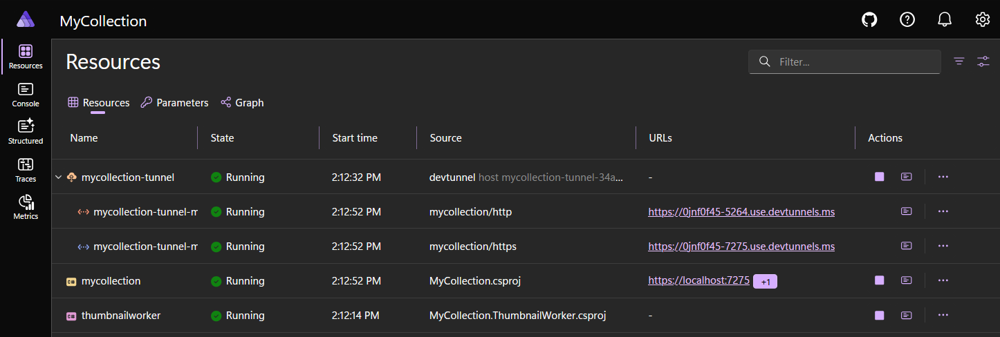

# Module 10: Background Processing with NServiceBus

[← Previous Module](09-photo-upload.md) | [Back to README](../README.md)

In this module, you'll add a background worker to `MyCollection` using **NServiceBus**. Your Blazor app already saves uploaded photos to `wwwroot\uploads\` from Module 9, and your Aspire AppHost already orchestrates the solution from Module 8. Now we're going to connect those two ideas.

Instead of doing every image task inside the upload request, you'll publish an NServiceBus event after a photo is saved. A separate console application will subscribe to that event, resize the uploaded image into a real thumbnail, and save the thumbnail as a **WebP** file.

That gives you a more realistic architecture:

1. The web app responds quickly
2. The thumbnail work runs in the background
3. Aspire starts both processes together and helps you observe them

> **Sponsor note:** This module is sponsored by [Particular Software](https://particular.net/), makers of NServiceBus.

By the end of this module, your solution will include:

- A shared message contract project
- A console app named `MyCollection.ThumbnailWorker`
- A published `ProcessPhotoUploaded` event from the Blazor app
- A background handler that creates `200x200` WebP thumbnails
- Aspire orchestration for both the web app and the worker
- Trace data in the Aspire dashboard showing the upload flow and the background work

---

## 1. Why Background Processing?

**Expected outcome:** You understand why the photo upload flow now needs a background worker instead of doing all image processing inside the request.

Right now, the photo upload flow from Module 9 is simple and direct:

1. The user selects a photo
2. The browser posts the file to the Blazor app
3. The app validates the file
4. The app saves the original image to disk
5. The app stores the filename in SQLite
6. The page refreshes and displays the image

That works well for a beginner app. It's exactly the right place to start.

But once you add more image work, the upload request starts carrying extra responsibility:

- Resize the image
- Convert it to a new format
- Save a second file
- Potentially extract metadata later
- Potentially run AI or moderation later

Those extra jobs aren't necessary for the user to get an immediate success response. The user only needs to know:

- Was the upload accepted?
- Did the item save correctly?
- Will the rest of the work continue?

That's where background processing helps.

### The beginner-friendly reason

A background worker lets the web app say:

> "The upload is saved. I will hand off the slow follow-up work to another process."

That keeps your UI more responsive and keeps the web request focused on just the part that must happen immediately.

### The architectural reason

This is also your first real example of **decoupling**. And I love this pattern.

The Blazor app doesn't need to know **how** thumbnail generation works. It only needs to announce that a photo was uploaded.

The worker doesn't need to know **who** uploaded the photo. It only needs to react to the event and do its job.

That separation gives you three benefits:

1. **Responsiveness** — the browser does not wait for image processing to finish
2. **Reliability** — if thumbnail creation fails, NServiceBus can retry the message instead of losing the whole upload flow
3. **Flexibility** — later, more subscribers could react to the same event without changing the upload page

### Synchronous vs. background in plain English

Here is the mental model to keep:

| Approach | What the request does |
|---|---|
| Synchronous | Upload file, resize it, convert it, save thumbnail, then return |
| Background processing | Upload file, save original, publish event, return quickly |

In this workshop, we are **not** moving the original file save into the background. The original upload still happens in the web app. The new background step is the thumbnail generation.

That is a good scope choice for beginners because:

- You already understand the upload flow from Module 9
- The app can still show the original image right away
- The worker adds one clear new idea without replacing everything you already built

### What you should see

By the end of this module, you should be able to describe the flow like this:

1. `MyCollection` saves the uploaded original photo
2. `MyCollection` publishes `ProcessPhotoUploaded`
3. `MyCollection.ThumbnailWorker` receives the event
4. The worker creates a WebP thumbnail in `wwwroot\uploads\thumbnails\`
5. The UI shows the generated thumbnail after the background work finishes

### What just happened

You drew a clear boundary between **user-facing request work** and **background follow-up work**. That boundary is the whole reason this module exists.

Further reading: [https://docs.particular.net/nservicebus/](https://docs.particular.net/nservicebus/)

---

## 2. NServiceBus Fundamentals

**Expected outcome:** You understand the small set of NServiceBus concepts needed for this module: endpoint, message, handler, and transport.

NServiceBus is a framework for building **message-driven .NET applications**.

That sentence can sound abstract, so let us shrink it down to this module.

In `MyCollection`, NServiceBus means:

- The web app publishes a message
- The worker listens for that message
- The worker handles the message later, outside the HTTP request

That is all you need to understand for this workshop.

### Four words to remember

#### 1. Endpoint

An **endpoint** is a running application that sends, publishes, receives, or handles messages.

In this module, you will have two endpoints:

- `MyCollection.Web` — the Blazor app that publishes an event
- `MyCollection.ThumbnailWorker` — the console app that subscribes and handles the event

#### 2. Message

A **message** is a plain C# class that represents something one endpoint wants to communicate to another.

For this module, the message is:

- `ProcessPhotoUploaded`

It will contain the data the worker needs in order to create a thumbnail.

#### 3. Handler

A **handler** is the class that receives a specific message type and performs the work.

For this module, the handler will:

1. Read the original image file from disk
2. Resize it to thumbnail dimensions
3. Encode it as WebP
4. Save the result into the thumbnails folder

#### 4. Transport

A **transport** is the mechanism NServiceBus uses to move messages.

For the workshop, you will use **Learning Transport**.

Learning Transport is intentionally simple:

- It is file-based
- It does not require RabbitMQ, Azure Service Bus, or SQL Server
- It stores messages in a `.learningtransport` folder on disk
- It is perfect for demos, workshops, and beginner experiments

### Event vs. command for this module

NServiceBus usually distinguishes between:

- **Commands** — "Please do this"
- **Events** — "This already happened"

Your module requirements ask for a class named `ProcessPhotoUploaded`.

That name reads a little like a command, but the flow you are building is really **event publication**:

- The upload already happened
- The app is now announcing that fact to interested subscribers

So in this workshop, `ProcessPhotoUploaded` will implement `IEvent`.

That keeps the architecture aligned with the requirement that the worker **subscribes** to something the web app **publishes**.

### Why Learning Transport needs shared storage

Learning Transport writes message files to disk.

That means both endpoints must look at the **same** storage root.

If each project writes to a different `.learningtransport` folder, they will never see each other's messages.

That is why later in this module you will explicitly configure both endpoints to use the same directory:

```csharp
transport.StorageDirectory(
    Path.GetFullPath(Path.Combine(builder.Environment.ContentRootPath, "..", ".learningtransport")));
```

That path walks up from the project folder to the solution root, then uses one shared `.learningtransport` directory for both endpoints.

### A small but important pub/sub note

With Learning Transport, subscribers register subscription metadata in files under `.learningtransport\.events\`.

That means the subscriber needs to be running so it can register its subscription.

For your local testing flow, that means:

1. Start the Aspire AppHost
2. Wait until the worker is running
3. Then upload a photo

If you upload too quickly on the very first run, just upload again after the worker is fully started.

### What you should see

After this module is complete, a quick look at the solution should reveal these roles:

- `MyCollection` -> publishes `ProcessPhotoUploaded`
- `MyCollection.ThumbnailWorker` -> handles `ProcessPhotoUploaded`
- `.learningtransport` -> local file-based message storage
- Aspire dashboard -> observes both resources

### What just happened

You reduced NServiceBus to the four pieces you actually need right now. That keeps the framework approachable and prevents you from trying to learn the entire ecosystem before writing one useful message flow.

Further reading:

- NServiceBus overview: [https://docs.particular.net/nservicebus/](https://docs.particular.net/nservicebus/)
- Learning Transport: [https://docs.particular.net/transports/learning/](https://docs.particular.net/transports/learning/)

---

## 3. Creating the Worker Console App

**Expected outcome:** You have a new console application named `MyCollection.ThumbnailWorker` that starts as an NServiceBus endpoint and can be launched by the .NET Generic Host.

The worker is a plain **console application**. That matters because you do not need a second web app here. You just need a process that stays alive, listens for NServiceBus messages, and runs handlers.

### Step 1: Create the project

From the solution root, run:

```bash
dotnet new console -n MyCollection.ThumbnailWorker
dotnet sln add .\MyCollection.ThumbnailWorker\MyCollection.ThumbnailWorker.csproj
```

### What you should see

After those commands complete:

- A new `MyCollection.ThumbnailWorker\` folder exists
- The project appears in the solution
- The project contains a default `Program.cs`

### Step 2: Add the packages and project reference

Add the packages the worker needs:

```bash
dotnet add .\MyCollection.ThumbnailWorker\MyCollection.ThumbnailWorker.csproj package NServiceBus.Extensions.Hosting
dotnet add .\MyCollection.ThumbnailWorker\MyCollection.ThumbnailWorker.csproj package NServiceBus.Transport.Learning
dotnet add .\MyCollection.ThumbnailWorker\MyCollection.ThumbnailWorker.csproj package SkiaSharp
dotnet add .\MyCollection.ThumbnailWorker\MyCollection.ThumbnailWorker.csproj reference .\MyCollection.ServiceDefaults\MyCollection.ServiceDefaults.csproj
```

You are adding four distinct capabilities here:

1. `NServiceBus.Extensions.Hosting` — so the endpoint can start and stop with the .NET Generic Host
2. `NServiceBus.Transport.Learning` — so messages can move through the file system without external infrastructure
3. `SkiaSharp` — so the worker can resize and encode images
4. `MyCollection.ServiceDefaults` — so the worker participates in Aspire logging and tracing the same way the web app does

### Step 3: Replace the project file

Open `MyCollection.ThumbnailWorker\MyCollection.ThumbnailWorker.csproj` and replace it with this content:

`MyCollection.ThumbnailWorker\MyCollection.ThumbnailWorker.csproj`

```xml
<Project Sdk="Microsoft.NET.Sdk">
  <PropertyGroup>
    <OutputType>Exe</OutputType>
    <TargetFramework>net10.0</TargetFramework>
    <ImplicitUsings>enable</ImplicitUsings>
    <Nullable>enable</Nullable>
  </PropertyGroup>

  <ItemGroup>
    <PackageReference Include="NServiceBus.Extensions.Hosting" Version="10.*" />
    <PackageReference Include="NServiceBus.Transport.Learning" Version="9.*" />
    <PackageReference Include="SkiaSharp" Version="2.*" />
  </ItemGroup>

  <ItemGroup>
    <ProjectReference Include="..\MyCollection.Messages\MyCollection.Messages.csproj" />
    <ProjectReference Include="..\MyCollection.ServiceDefaults\MyCollection.ServiceDefaults.csproj" />
  </ItemGroup>
</Project>
```

Do not worry if your installed versions resolve to slightly newer patch releases. The important part is the package role, not the exact last digit.

### Step 4: Replace `Program.cs`

Now replace the default `Program.cs` with this host-based version:

`MyCollection.ThumbnailWorker\Program.cs`

```csharp
using Microsoft.Extensions.Hosting;
using MyCollection.ThumbnailWorker.Services;
using NServiceBus;

var builder = Host.CreateApplicationBuilder(args);

builder.AddServiceDefaults();
builder.Services.AddSingleton<ThumbnailGenerator>();

var endpointConfiguration = new EndpointConfiguration("MyCollection.ThumbnailWorker");
endpointConfiguration.UseSerialization<SystemJsonSerializer>();

var transport = endpointConfiguration.UseTransport<LearningTransport>();
transport.StorageDirectory(
    Path.GetFullPath(Path.Combine(builder.Environment.ContentRootPath, "..", ".learningtransport")));

builder.UseNServiceBus(endpointConfiguration);

var host = builder.Build();
await host.RunAsync();
```

### Why this program is so short

That file is small on purpose.

It does only four things:

1. Creates a Generic Host builder
2. Adds Aspire service defaults
3. Configures the NServiceBus endpoint
4. Runs the host forever until you stop it

The actual business logic will live in the handler and thumbnail service, not in `Program.cs`.

### How NServiceBus finds your handlers

When you call `builder.UseNServiceBus(endpointConfiguration)`, NServiceBus scans the assembly for any class that implements `IHandleMessages<T>`. It automatically registers each one as a handler for its message type.

You do not need to manually wire up handlers in `Program.cs`. Just create a class that implements the interface, and NServiceBus finds it at startup.

This is why `Program.cs` has no reference to `ProcessPhotoUploadedHandler` — NServiceBus discovers it by convention. Later in this module you'll see the handler class, and you'll notice it lives in the worker project, not in the startup file. That's exactly how NServiceBus is designed to work: declare your intent through an interface, and the framework handles the wiring.

### Why `builder.AddServiceDefaults()` matters here

You already learned in the Aspire module that `ServiceDefaults` centralizes logging, tracing, and health setup.

Using it in the worker means the worker becomes a first-class observable resource in the Aspire dashboard instead of just "some extra console process."

### Why you are setting `StorageDirectory(...)`

This is one of the most important lines in the entire module.

If you skip it, the web app and the worker may each create their own local Learning Transport storage root depending on where they start.

By forcing both endpoints to use:

```text
<solution root>\.learningtransport
```

you guarantee they can communicate.

### What you should see

At this point, you should have:

- A new worker project in the solution
- A `Program.cs` that uses `Host.CreateApplicationBuilder(args)`
- A worker project that references both `MyCollection.Messages` and `MyCollection.ServiceDefaults`
- A clearly shared Learning Transport folder strategy

### What just happened

You created the host process that will do the background work. The worker still does nothing useful yet, but the runtime shell for the endpoint is now in place.

---

## 4. Defining the Message

**Expected outcome:** You have a shared class library named `MyCollection.Messages` that contains a `ProcessPhotoUploaded` event contract used by both the web app and the worker.

A message contract has to be shared.

If the web app and the worker each define their own local copy of `ProcessPhotoUploaded`, you now have two types with the same name but different identities. That causes confusion fast.

The clean solution is a tiny class library that contains message contracts only.

### Step 1: Create the shared message project

From the solution root, run:

```bash
dotnet new classlib -n MyCollection.Messages
dotnet sln add .\MyCollection.Messages\MyCollection.Messages.csproj
dotnet add .\MyCollection.Messages\MyCollection.Messages.csproj package NServiceBus
```

### Step 2: Replace the message project file

Open `MyCollection.Messages\MyCollection.Messages.csproj` and replace it with this content:

`MyCollection.Messages\MyCollection.Messages.csproj`

```xml
<Project Sdk="Microsoft.NET.Sdk">
  <PropertyGroup>
    <TargetFramework>net10.0</TargetFramework>
    <ImplicitUsings>enable</ImplicitUsings>
    <Nullable>enable</Nullable>
  </PropertyGroup>

  <ItemGroup>
    <PackageReference Include="NServiceBus" Version="10.*" />
  </ItemGroup>
</Project>
```

### Step 3: Add references from the app and the worker

Now make both endpoints reference the shared message project:

```bash
dotnet add .\MyCollection\MyCollection.csproj reference .\MyCollection.Messages\MyCollection.Messages.csproj
dotnet add .\MyCollection.ThumbnailWorker\MyCollection.ThumbnailWorker.csproj reference .\MyCollection.Messages\MyCollection.Messages.csproj
```

### Step 4: Create the `ProcessPhotoUploaded` class

Delete the default `Class1.cs` file and create `ProcessPhotoUploaded.cs` with this content:

`MyCollection.Messages\ProcessPhotoUploaded.cs`

```csharp
using NServiceBus;

namespace MyCollection.Messages;

public class ProcessPhotoUploaded : IEvent
{
    public int ItemId { get; set; }
    public string PhotoFileName { get; set; } = string.Empty;
    public string OriginalPhotoPath { get; set; } = string.Empty;
    public string ThumbnailPhotoPath { get; set; } = string.Empty;
}
```

### Why these properties exist

Each property has one clear job:

- `ItemId` — useful for logs and for connecting the work back to a collection item
- `PhotoFileName` — useful for logs and display naming
- `OriginalPhotoPath` — tells the worker where the uploaded original lives
- `ThumbnailPhotoPath` — tells the worker exactly where to save the generated thumbnail

For a real production system, you would often avoid moving absolute file paths around in messages and instead rely on shared storage conventions or durable storage metadata.

For this workshop, the direct path approach is a good tradeoff because:

- It keeps the handler small
- It avoids additional database work in the worker
- It stays focused on messaging and background processing

### A note about the class name

A more domain-oriented event name might be `PhotoUploaded`.

However, the workshop requirement explicitly calls for `ProcessPhotoUploaded`, and beginners will likely find that name easy to connect to the thumbnail operation.

So we will keep the required name and treat it as an **event contract**.

### What you should see

When this section is complete:

- `MyCollection.Messages` exists in the solution
- `Class1.cs` is gone
- `ProcessPhotoUploaded.cs` compiles cleanly
- Both the app and the worker reference the same contract project

### What just happened

You created the shared language both endpoints will speak. That is the contract-first part of message-driven design.

---

## 5. Writing the Image Handler

**Expected outcome:** The worker contains an NServiceBus handler that receives `ProcessPhotoUploaded`, resizes the original image, and saves a WebP thumbnail.

This section is the heart of the module.

The worker now needs two things:

1. A service that knows how to generate thumbnails
2. A handler that calls that service when the message arrives

Keeping those separate is a good beginner habit because it keeps message handling code small and keeps image code testable and reusable.

### Step 1: Create the thumbnail service folder

Inside `MyCollection.ThumbnailWorker`, create a `Services` folder.

Then add `ThumbnailGenerator.cs` with this content:

`MyCollection.ThumbnailWorker\Services\ThumbnailGenerator.cs`

```csharp
using SkiaSharp;

namespace MyCollection.ThumbnailWorker.Services;

public class ThumbnailGenerator
{
    private const int ThumbnailWidth = 200;
    private const int ThumbnailHeight = 200;
    private const int WebpQuality = 80;

    public async Task CreateThumbnailAsync(string sourcePath, string destinationPath)
    {
        if (!File.Exists(sourcePath))
        {
            throw new FileNotFoundException("The source image could not be found.", sourcePath);
        }

        Directory.CreateDirectory(Path.GetDirectoryName(destinationPath)!);

        using var sourceStream = File.OpenRead(sourcePath);
        using var sourceBitmap = SKBitmap.Decode(sourceStream);

        if (sourceBitmap is null)
        {
            throw new InvalidOperationException($"Could not decode image '{sourcePath}'.");
        }

        using var outputBitmap = new SKBitmap(ThumbnailWidth, ThumbnailHeight);
        using var canvas = new SKCanvas(outputBitmap);
        canvas.Clear(SKColors.White);

        var scale = Math.Min(
            (float)ThumbnailWidth / sourceBitmap.Width,
            (float)ThumbnailHeight / sourceBitmap.Height);

        var scaledWidth = sourceBitmap.Width * scale;
        var scaledHeight = sourceBitmap.Height * scale;
        var left = (ThumbnailWidth - scaledWidth) / 2;
        var top = (ThumbnailHeight - scaledHeight) / 2;

        var destinationRectangle = new SKRect(
            left,
            top,
            left + scaledWidth,
            top + scaledHeight);

        canvas.DrawBitmap(sourceBitmap, destinationRectangle);
        canvas.Flush();

        using var image = SKImage.FromBitmap(outputBitmap);
        using var encodedData = image.Encode(SKEncodedImageFormat.Webp, WebpQuality);

        await using var outputStream = File.Create(destinationPath);
        encodedData.SaveTo(outputStream);
    }
}
```

### What this service is doing

Read that service in slow motion:

1. It checks that the original file exists
2. It creates the thumbnail folder if needed
3. It loads the uploaded image with SkiaSharp
4. It creates a `200x200` output canvas
5. It scales the image to fit inside the box while preserving aspect ratio
6. It centers the scaled image inside the box
7. It encodes the result as WebP
8. It writes the WebP file to disk

### Why the thumbnail is `200x200`

You need a size that is:

- Small enough for a list view
- Big enough to still look clear
- Easy for beginners to reason about

`200x200` is a nice teaching size because it is obvious and easy to verify visually.

### Why you preserve aspect ratio

If you forced every image to exactly fill the box without scaling carefully, portrait images and landscape images would look stretched.

Using the smaller scale factor avoids distortion.

### Why the background is white

Some uploaded files may be PNG images with transparency.

Filling the canvas with white gives you a predictable thumbnail background in the workshop UI.

### Step 2: Add the NServiceBus handler

Create `ProcessPhotoUploadedHandler.cs` in the worker project:

`MyCollection.ThumbnailWorker\ProcessPhotoUploadedHandler.cs`

```csharp
using MyCollection.Messages;
using MyCollection.ThumbnailWorker.Services;
using NServiceBus;

namespace MyCollection.ThumbnailWorker;

public class ProcessPhotoUploadedHandler : IHandleMessages<ProcessPhotoUploaded>
{
    private readonly ThumbnailGenerator thumbnailGenerator;
    private readonly ILogger<ProcessPhotoUploadedHandler> logger;

    public ProcessPhotoUploadedHandler(
        ThumbnailGenerator thumbnailGenerator,
        ILogger<ProcessPhotoUploadedHandler> logger)
    {
        this.thumbnailGenerator = thumbnailGenerator;
        this.logger = logger;
    }

    public async Task Handle(ProcessPhotoUploaded message, IMessageHandlerContext context)
    {
        logger.LogInformation(
            "Processing uploaded photo for item {ItemId}: {PhotoFileName}",
            message.ItemId,
            message.PhotoFileName);

        await thumbnailGenerator.CreateThumbnailAsync(
            message.OriginalPhotoPath,
            message.ThumbnailPhotoPath);

        logger.LogInformation(
            "Thumbnail created at {ThumbnailPhotoPath}",
            message.ThumbnailPhotoPath);
    }
}
```

### Why the handler is simple

The handler does not know anything about Blazor.

It does not know anything about SQLite.

It does not know anything about HTML.

That is exactly the point.

The handler's job is narrow:

1. Receive the message
2. Call the image service
3. Log the outcome

### Why you should not swallow exceptions here

Notice that the handler does **not** wrap everything in a big `try/catch` that hides failures.

That is intentional.

If thumbnail generation fails, you want NServiceBus to know the message failed so it can retry or move the message to the error queue.

If you catch the exception and pretend success, you lose the whole value of the message system.

### Step 3: Understand the folder result

The handler will save thumbnails here:

```text
MyCollection\wwwroot\uploads\thumbnails\<same-guid-name>.webp
```

If the original uploaded file is:

```text
wwwroot\uploads\4e01d0f1-7e8f-4cde-9417-65c1d71d9174.jpg
```

then the generated thumbnail will be:

```text
wwwroot\uploads\thumbnails\4e01d0f1-7e8f-4cde-9417-65c1d71d9174.webp
```

That naming convention is important because the web app can derive the thumbnail URL from the original filename.

### What you should see

Once this section is finished, the worker project contains:

- `Program.cs`
- `ProcessPhotoUploadedHandler.cs`
- `Services\ThumbnailGenerator.cs`

And you should be able to explain the flow like this:

1. NServiceBus receives `ProcessPhotoUploaded`
2. The handler invokes `ThumbnailGenerator`
3. SkiaSharp creates the thumbnail
4. The `.webp` file is written to the thumbnails folder

### What just happened

You finished the actual background-processing logic. From this point on, the missing piece is simply getting the web app to publish the message.

---

## 6. Publishing from the Blazor App

**Expected outcome:** The `MyCollection` app is configured as an NServiceBus endpoint, and the upload flow publishes `ProcessPhotoUploaded` after a photo is saved.

The web app already knows how to save the original photo. That part stays.

What changes now is what happens **after** the original save succeeds.

The sequence becomes:

1. Save original photo
2. Save item to the database
3. Publish `ProcessPhotoUploaded`
4. Return control to the user
5. Let the background worker handle the thumbnail

### Step 1: Add the NServiceBus packages and message project reference

From the solution root, run:

```bash
dotnet add .\MyCollection\MyCollection.csproj package NServiceBus.Extensions.Hosting
dotnet add .\MyCollection\MyCollection.csproj package NServiceBus.Transport.Learning
dotnet add .\MyCollection\MyCollection.csproj reference .\MyCollection.Messages\MyCollection.Messages.csproj
```

### Step 2: Update `MyCollection\Program.cs`

Replace `MyCollection\Program.cs` with this version that includes both Aspire and NServiceBus setup:

`MyCollection\Program.cs`

```csharp
using Microsoft.EntityFrameworkCore;
using MyCollection.Components;
using MyCollection.Data;
using NServiceBus;

var builder = WebApplication.CreateBuilder(args);

builder.AddServiceDefaults();

var endpointConfiguration = new EndpointConfiguration("MyCollection.Web");
endpointConfiguration.UseSerialization<SystemJsonSerializer>();

var transport = endpointConfiguration.UseTransport<LearningTransport>();
transport.StorageDirectory(
    Path.GetFullPath(Path.Combine(builder.Environment.ContentRootPath, "..", ".learningtransport")));

builder.Host.UseNServiceBus(endpointConfiguration);

builder.Services.AddRazorComponents()
    .AddInteractiveServerComponents();

builder.Services.AddDbContext<CollectionContext>(options =>
    options.UseSqlite("Data Source=MyCollection.db"));

var app = builder.Build();

if (!app.Environment.IsDevelopment())
{
    app.UseExceptionHandler("/Error", createScopeForErrors: true);
    app.UseHsts();
}

app.UseStatusCodePagesWithReExecute("/not-found", createScopeForStatusCodePages: true);
app.UseHttpsRedirection();
app.UseAntiforgery();
app.MapStaticAssets();

app.MapRazorComponents<App>()
    .AddInteractiveServerRenderMode();

app.MapDefaultEndpoints();

app.Run();
```

### Why `IMessageSession` becomes available

Once `builder.Host.UseNServiceBus(endpointConfiguration);` is in place, NServiceBus registers `IMessageSession` in dependency injection.

That means you can inject it into your Blazor page the same way you inject `CollectionContext` or `IWebHostEnvironment`.

### Step 3: Add the NServiceBus injection to `Collection.razor`

At the top of `MyCollection\Components\Pages\Collection.razor`, make sure you have these directives:

```razor
@using MyCollection.Messages
@using NServiceBus
@inject CollectionContext Context
@inject IWebHostEnvironment Env
@inject IMessageSession MessageSession
```

### Step 4: Update the photo display markup

Replace the `img` element inside the list with this version:

```razor

```

Why change this line?

Because the page should now prefer the generated WebP thumbnail **if it exists**, but still fall back to the original uploaded image while the background work is still happening.

### Step 5: Update `AddItemAsync`

Replace your current `AddItemAsync` method with this version:

```csharp
private async Task AddItemAsync()
{
    if (string.IsNullOrWhiteSpace(newItem.Name))
    {
        statusMessage = "Enter a name before adding an item.";
        return;
    }

    string? savedFileName = null;

    if (selectedFile is not null)
    {
        savedFileName = await SavePhotoAsync(selectedFile);
        if (savedFileName is null)
        {
            return;
        }

        newItem.PhotoFileName = savedFileName;
    }

    newItem.DateAdded = DateTime.Today;
    Context.CollectionItems.Add(newItem);
    await Context.SaveChangesAsync();

    if (savedFileName is not null)
    {
        await PublishPhotoUploadedEventAsync(newItem.Id, savedFileName);
        statusMessage = $"Added: {newItem.Name}. Thumbnail processing started in the background.";
    }
    else
    {
        statusMessage = $"Added: {newItem.Name}";
    }

    newItem = new CollectionItem { DateAdded = DateTime.Today };
    selectedFile = null;
    await LoadItemsAsync();
}
```

### Why you publish after `SaveChangesAsync()`

That ordering matters.

You want to publish the event only after:

- The uploaded file exists on disk
- The database row exists
- The item has a real `Id`

If you published before the save and something failed, the worker could try to process a file or item state that was never really committed.

### Step 6: Add the helper methods

Add these helper methods to the `@code` block in `Collection.razor`:

```csharp
private async Task PublishPhotoUploadedEventAsync(int itemId, string photoFileName)
{
    var sourcePath = Path.Combine(Env.WebRootPath, "uploads", photoFileName);
    var thumbnailFileName = $"{Path.GetFileNameWithoutExtension(photoFileName)}.webp";
    var thumbnailPath = Path.Combine(Env.WebRootPath, "uploads", "thumbnails", thumbnailFileName);

    var options = new PublishOptions();
    options.ContinueExistingTraceOnReceive();

    await MessageSession.Publish(
        new ProcessPhotoUploaded
        {
            ItemId = itemId,
            PhotoFileName = photoFileName,
            OriginalPhotoPath = sourcePath,
            ThumbnailPhotoPath = thumbnailPath
        },
        options);
}

private string GetDisplayPhotoUrl(CollectionItem item)
{
    if (string.IsNullOrWhiteSpace(item.PhotoFileName))
    {
        return "https://placehold.co/80x80?text=No+Photo";
    }

    var thumbnailFileName = $"{Path.GetFileNameWithoutExtension(item.PhotoFileName)}.webp";
    var thumbnailPhysicalPath = Path.Combine(
        Env.WebRootPath,
        "uploads",
        "thumbnails",
        thumbnailFileName);

    return File.Exists(thumbnailPhysicalPath)
        ? $"/uploads/thumbnails/{thumbnailFileName}"
        : $"/uploads/{item.PhotoFileName}";
}
```

### Why `ContinueExistingTraceOnReceive()` is helpful

By default, pub/sub traces are often connected with **links** instead of showing up in one continuous parent-child chain.

That is valid distributed tracing behavior, but it can be harder for beginners to follow in the dashboard.

Using:

```csharp
options.ContinueExistingTraceOnReceive();
```

makes the workshop trace easier to read because the handler can continue the same trace when it receives the event.

### Step 7: Keep `SavePhotoAsync` exactly focused on the original upload

Do **not** move thumbnail generation into `SavePhotoAsync`.

That method should still only do the original photo save.

That is the clean division of responsibilities:

- `SavePhotoAsync` -> save the original upload
- `PublishPhotoUploadedEventAsync` -> announce that the upload happened
- `MyCollection.ThumbnailWorker` -> create the thumbnail later

### What you should see

When this section is complete:

- The app still uploads photos successfully
- The page status message now mentions background thumbnail processing
- `Collection.razor` publishes a message only when a photo exists
- The UI can display either the original image or the generated thumbnail

### What just happened

You turned the upload page into a **publisher**. It still owns the original user interaction, but it no longer owns the thumbnail work.

---

## 7. Wiring into Aspire AppHost

**Expected outcome:** Aspire starts both the Blazor app and the thumbnail worker, and the shared telemetry configuration includes NServiceBus traces.

You already added Aspire in the previous module. That means the AppHost exists, `ServiceDefaults` exists, and `aspire run` is already your standard launch flow.

Now you will teach Aspire about the new worker.

### Step 1: Add the worker project reference to the AppHost project

Open `MyCollection.AppHost\MyCollection.AppHost.csproj`.

Make sure the project references include the new worker:

`MyCollection.AppHost\MyCollection.AppHost.csproj`

```xml
<Project Sdk="Microsoft.NET.Sdk">
  <PropertyGroup>
    <OutputType>Exe</OutputType>
    <TargetFramework>net10.0</TargetFramework>
    <ImplicitUsings>enable</ImplicitUsings>
    <Nullable>enable</Nullable>
    <IsAspireHost>true</IsAspireHost>
  </PropertyGroup>

  <ItemGroup>
    <ProjectReference Include="..\MyCollection\MyCollection.csproj" />
    <ProjectReference Include="..\MyCollection.ThumbnailWorker\MyCollection.ThumbnailWorker.csproj" />
  </ItemGroup>

  <ItemGroup>
    <PackageReference Include="Aspire.Hosting.AppHost" Version="13.*" />
  </ItemGroup>
</Project>
```

### Step 2: Register the worker in the AppHost

Now update `MyCollection.AppHost\Program.cs` so Aspire launches both projects:

`MyCollection.AppHost\Program.cs`

```csharp
var builder = DistributedApplication.CreateBuilder(args);

builder.AddProject<Projects.MyCollection>("mycollection");
builder.AddProject<Projects.MyCollection_ThumbnailWorker>("thumbnailworker");

builder.Build().Run();
```

### Why the generated type uses an underscore

Aspire generates a `Projects` type for each referenced project.

When the project name contains dots, those dots often become underscores in the generated type name.

So this project:

```text
MyCollection.ThumbnailWorker
```

usually appears in AppHost code as:

```csharp
Projects.MyCollection_ThumbnailWorker
```

If your generated name looks slightly different, trust the generated `Projects` namespace in your solution.

### Step 3: Update `ServiceDefaults` so NServiceBus spans appear in Aspire

Because the worker is using `ServiceDefaults`, this is the right place to teach OpenTelemetry about NServiceBus activities.

Open `MyCollection.ServiceDefaults\Extensions.cs` and update the tracing section.

Look for the current `.WithTracing(...)` block and make sure it includes `AddSource("NServiceBus.Core")`:

`MyCollection.ServiceDefaults\Extensions.cs`

```csharp
builder.Services.AddOpenTelemetry()
    .WithMetrics(metrics =>
    {
        metrics.AddAspNetCoreInstrumentation()
            .AddHttpClientInstrumentation()
            .AddRuntimeInstrumentation();
    })
    .WithTracing(tracing =>
    {
        tracing.AddSource(builder.Environment.ApplicationName)
            .AddSource("NServiceBus.Core")
            .AddAspNetCoreInstrumentation(options =>
            {
                options.Filter = context =>
                    !context.Request.Path.StartsWithSegments(HealthEndpointPath) &&
                    !context.Request.Path.StartsWithSegments(AlivenessEndpointPath);
            })
            .AddHttpClientInstrumentation();
    });
```

### Why this matters

Without that extra source, Aspire will still know your processes are running, but it may not capture the message-processing spans you care about.

Adding:

```csharp
.AddSource("NServiceBus.Core")
```

tells OpenTelemetry to collect the NServiceBus activities created during publish and message processing.

### Step 4: Understand why there is no `.WithReference(...)` here

In the Aspire module, `.WithReference(...)` made sense for resources like databases and connection strings.

That is not the situation here.

The worker does not need a connection string from the web app.

The web app does not need a connection string from the worker.

Both endpoints simply need to start together and point at the same Learning Transport directory on disk.

So the AppHost stays simple:

- add the web project
- add the worker project
- run them both

### What you should see

After this section, the AppHost should know about two application resources:

- `mycollection`
- `thumbnailworker`

And your shared telemetry setup should now understand both:

- ASP.NET request activity
- NServiceBus publish activity
- NServiceBus message-processing activity

### What just happened

You connected the new background worker to the orchestration layer you already built in Aspire. That turns the worker from "an extra executable" into part of the actual local application model.

---

## 8. Running and Testing

**Expected outcome:** You can start the solution with `aspire run`, upload a photo, and verify that a generated WebP thumbnail appears after the background worker finishes.

Now it is time to watch the whole flow work together.

### Step 1: Build the solution

From the solution root, run:

```bash
dotnet build
```

### What you should see

You should see a successful build for:

- `MyCollection.Messages`
- `MyCollection.ThumbnailWorker`
- `MyCollection`
- `MyCollection.ServiceDefaults`
- `MyCollection.AppHost`

If the build fails, the most common causes are:

- A missing project reference
- A missing `using` statement
- A typo in the generated `Projects.MyCollection_ThumbnailWorker` type name
- A missing NuGet package restore

### Step 2: Start the app through Aspire

Run:

```bash
aspire run
```

Use the dashboard URL that Aspire prints in the terminal.

### What you should see

In the Aspire dashboard resources view, wait until both resources are running:

- `mycollection`
- `thumbnailworker`



Do not rush to upload on the first second of startup.

Give the worker a moment to start so it can register its event subscription.

### Step 3: Upload a photo in the app

Open the `MyCollection` URL from the dashboard.

Then:

1. Go to the collection page
2. Add a new item name and description
3. Pick a photo file
4. Click **Add**

### What you should see

Immediately after the save:

- The item is added successfully
- The status message says thumbnail processing started in the background
- The list can still show the original photo while background work is catching up

A few moments later, after refreshing the page, the item should display the generated thumbnail instead.

### Step 4: Verify the generated thumbnail on disk

Open the uploads folder in your project.

You should find:

```text
MyCollection\wwwroot\uploads\<guid>.jpg
MyCollection\wwwroot\uploads\thumbnails\<same-guid>.webp
```

### What you should see

You should now have:

- The original uploaded file in `wwwroot\uploads\`
- The generated thumbnail in `wwwroot\uploads\thumbnails\`
- A `.webp` extension for the thumbnail file

### Step 5: Verify the worker logs

Back in the Aspire dashboard, open the logs for `thumbnailworker`.

Look for messages like:

```text
Processing uploaded photo for item 12: 4e01d0f1-7e8f-4cde-9417-65c1d71d9174.jpg
Thumbnail created at D:\GetStartedWebWorkshop\MyCollection\wwwroot\uploads\thumbnails\4e01d0f1-7e8f-4cde-9417-65c1d71d9174.webp
```

The exact item id, path, and filename will be different on your machine.

### If the thumbnail does not appear

Use this troubleshooting checklist:

1. Confirm both resources are running in Aspire
2. Confirm the upload succeeded and the original file exists
3. Confirm the worker project references `MyCollection.Messages`
4. Confirm both endpoints point to the same `.learningtransport` folder
5. Confirm `GetDisplayPhotoUrl(item)` points to `/uploads/thumbnails/<guid>.webp`
6. Refresh the page after the worker logs show success

### A first-run behavior to expect

On your very first launch, if you upload before the worker has registered its subscription, the publish may happen before the subscriber is ready.

That is not a bug in your code.

It is simply how local pub/sub registration works.

If that happens:

1. Wait until `thumbnailworker` is definitely running
2. Upload another photo
3. Verify the next thumbnail appears

### What just happened

You proved the architecture end to end:

- Web request saves original file
- Event is published
- Worker receives the event
- Thumbnail is created asynchronously
- The UI can use the result later

That is real background processing, not just a theory diagram.

---

## 9. Monitoring in the Aspire Dashboard

**Expected outcome:** You can use the Aspire dashboard to observe the web request, the published NServiceBus event, and the worker's message handling activity.

This section is where Aspire and NServiceBus finally meet in a visible way.

You now have more than one running process, so the dashboard becomes much more valuable than it was with just the web app alone.

### Step 1: Start by generating one fresh upload

With the dashboard already open:

1. Upload a new photo in `MyCollection`
2. Return to the dashboard immediately afterward

You are going to inspect three places:

- Resources
- Logs
- Traces

### Step 2: Check the Resources view

The **Resources** view answers the first question:

> "Are both application parts healthy and running?"

You should see at least these two resources:

- `mycollection`
- `thumbnailworker`

### What you should see

Both resources should show a running state.

If `thumbnailworker` is stopped or crashing, go to its logs first before staring at traces.

### Step 3: Inspect web app logs

Open logs for `mycollection`.

You are looking for signs of the upload request itself:

- Normal request activity
- No unexpected exceptions
- Your user-facing success path completing cleanly

Remember: the web app is **publishing** the event, not generating the thumbnail directly.

So its logs should look lighter than a fully synchronous image-processing flow.

### Step 4: Inspect worker logs

Now open logs for `thumbnailworker`.

These are the logs that prove the event was handled.

You should expect to see messages like:

- Processing uploaded photo for item...
- Thumbnail created at...

If the worker fails processing, this is the first place you will usually spot it.

### Step 5: Open the Traces view

Now go to the **Traces** view in the Aspire dashboard.

Because you added `AddSource("NServiceBus.Core")` to `ServiceDefaults`, and because you published with `ContinueExistingTraceOnReceive()`, the trace view should be much easier to follow.

### What you should look for in the trace

You are trying to connect three ideas inside one observation flow:

1. The incoming HTTP request to the Blazor app
2. The NServiceBus publish activity
3. The worker's message-processing activity

Depending on the exact package versions on your machine, the dashboard may display the relationship in one of two valid ways:

- As one continued parent-child trace
- As linked traces between publish and process spans

For this workshop, using `ContinueExistingTraceOnReceive()` usually makes the flow easier to see as one continued trace.

### Why that trace matters

This is more than a pretty graph.

It lets you answer real questions:

- Did the upload request happen?
- Did the event publish happen?
- Did the worker handle it?
- Which step took the most time?
- If something failed, where did it fail?

That is exactly the observability story Aspire is supposed to improve.

### Step 6: Use a simple beginner workflow for debugging

When something seems wrong, use this order:

1. Confirm both resources are running
2. Reproduce the upload once
3. Check `mycollection` logs
4. Check `thumbnailworker` logs
5. Open traces and follow the request-to-handler path
6. Check the thumbnail file on disk

That sequence is much less overwhelming than clicking every tab at random.

### What you should see

After one successful upload, you should be able to say all of these are true:

- The dashboard shows both resources
- The worker logs confirm the message was handled
- The Traces view shows publish and processing activity
- The generated `.webp` thumbnail exists on disk
- Refreshing the app shows the thumbnail output in the UI

### Final recap

In this module, you:

- Added a new console application as an NServiceBus endpoint
- Used Learning Transport so no external queue was required
- Created a shared `ProcessPhotoUploaded` event contract
- Published that event from the Blazor upload flow
- Handled the event in a background worker
- Generated a `200x200` WebP thumbnail with SkiaSharp
- Registered the worker in the Aspire AppHost
- Added NServiceBus tracing to `ServiceDefaults`
- Used the Aspire dashboard to observe the end-to-end message flow

That is a big step forward for the application.

`MyCollection` is no longer just a single web app doing everything inline. It now has a real background-processing path, which is exactly the kind of design you will build on in later modules.

### What just happened

You connected UI work, messaging, background processing, and observability into one cohesive feature. This is one of the first places where the app truly starts to feel like a multi-process system instead of just a single website.

Further reading:

- NServiceBus Generic Host integration: [https://docs.particular.net/nservicebus/hosting/extensions-hosting/](https://docs.particular.net/nservicebus/hosting/extensions-hosting/)
- NServiceBus OpenTelemetry: [https://docs.particular.net/nservicebus/operations/opentelemetry/](https://docs.particular.net/nservicebus/operations/opentelemetry/)
- Learning Transport: [https://docs.particular.net/transports/learning/](https://docs.particular.net/transports/learning/)

---

## Next Module

[Module 11: Add AI →](11-add-ai.md)
